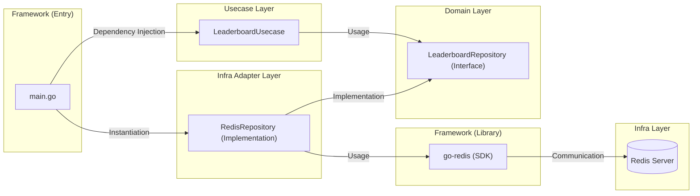
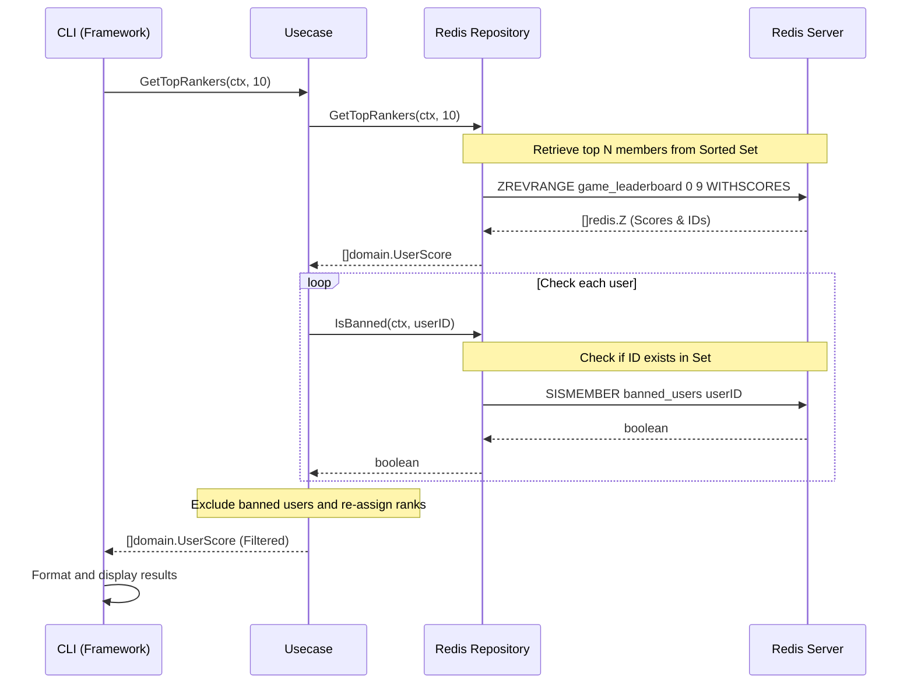

# Redis Workshop: Real-time Game Leaderboard with Sorted Sets

In this workshop, you will build a "Real-time Game Leaderboard System" that can handle millions of users using Redis's powerful data structure, **Sorted Sets (ZSET)**.
You will implement a CLI tool using Go to learn practical features such as updating and retrieving rankings, and excluding (filtering) fraudulent users.

## Goals

Build a leaderboard system with the following features based on **Clean Architecture**:

1. **Score Registration (ZADD):** Register/update user scores.
2. **Real-time Rank Retrieval (ZREVRANK):** Instantly retrieve a specific user's current rank (starting from 1st).
3. **Top Ranker Display (ZREVRANGE):** Display a list of the top N users.
4. **Cheater Mitigation (Sets - SADD):** Register fraudulent users in a blacklist (Set) and exclude them from ranking displays.

---

## Architecture

The Go application in this workshop is composed of 4 layers of Clean Architecture for maintainability and scalability.

### Layer Structure and Dependencies



- **Domain Layer:** Defines business entities (UserScore) and repository interfaces.
- **Usecase Layer:** Implements business rules such as filtering logic during ranking retrieval.
- **Infra Layer:** Responsible for specific access to Redis (using go-redis).
- **Framework Layer (Main):** Dependency Injection (DI) and CLI input/output.

---

## System Flow: Retrieving Rankings (Top Rankers)

Shows the flow of how the Usecase layer uses the Infra layer (Redis) to filter out banned users.



---

## Preparation

### 1. Start Redis (Podman/Docker)

Start Redis for development and verification.

```bash
podman run -d --name redis-leaderboard -p 6379:6379 redis:latest
```

### 2. Project Setup

```bash
cd infra/assets/redis_leaderboard
go mod tidy
```

---

## Implementation Points

### Leveraging Sorted Sets (ZSET)

Redis Sorted Sets hold unique members (like user IDs) associated with scores (numeric values).
Redis automatically sorts the data whenever it's added or updated, so the application doesn't need to perform sorting, making it extremely fast.

- `ZADD`: Add/update scores. $O(\log N)$
- `ZREVRANGE`: Retrieve a range of scores in descending order. $O(\log N + M)$
- `ZREVRANK`: Retrieve the descending rank of a specified member. $O(\log N)$

### Managing Ban Lists with Sets

To prevent specific users from appearing in the rankings, we use Redis's **Sets** data structure to manage the banned user list.

- `SADD`: Add a user to the ban list.
- `SISMEMBER`: Determine if a user is banned in $O(1)$ time.

---

## Trying it out

Use the implemented CLI tool to interact with the rankings.

### 1. Adding Scores

```bash
go run main.go add user1 100
go run main.go add user2 250
go run main.go add user3 180
```

### 2. Displaying Rankings

```bash
go run main.go top 3
```

**Expected Output:**

```text
--- Top 3 Rankers ---
1. user2: 250.00
2. user3: 180.00
3. user1: 100.00
```

### 3. Checking a Specific User's Rank

```bash
go run main.go rank user3
```

### 4. Banning a Fraudulent User

```bash
go run main.go ban user2
go run main.go top 3
```

**Expected Output:**
`user2` is excluded, and `user3` is promoted to 1st place.

```text
--- Top 3 Rankers ---
1. user3: 180.00
2. user1: 100.00
```

---

## Summary

By using Redis Sorted Sets, we've seen that large-scale leaderboard systems can be built extremely efficiently without complex calculations or sorting on the application side.
Furthermore, by adopting Clean Architecture, the system can adapt to future changes, such as switching to a different storage other than Redis or exposing features as a Web API, without modifying the core logic (Usecase).
