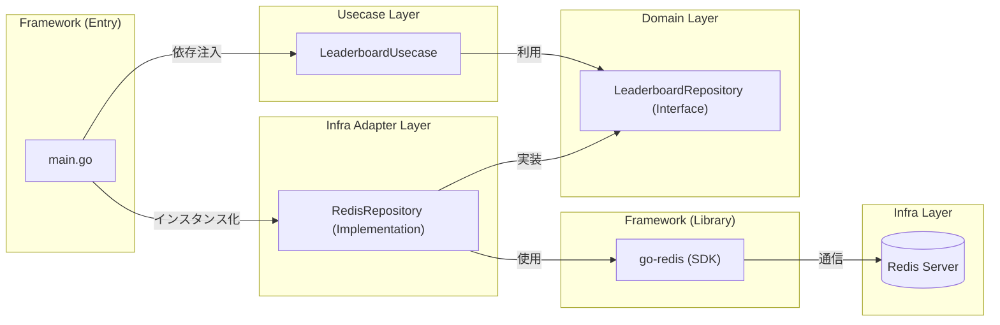
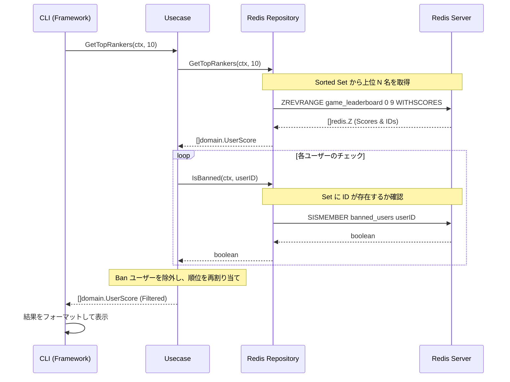

# Redis 実習：Sorted Sets で作るリアルタイム・ゲームランキング

この実習では、Redis の強力なデータ構造である **Sorted Sets (ZSET)** を使用して、数百万人のユーザーにも対応可能な「リアルタイム・ゲームランキングシステム」を構築します。
Go 言語を用いて CLI ツールを実装し、ランキングの更新、取得、そして不正ユーザーの除外（フィルタリング）といった実戦的な機能を学びます。

## ゴール

以下の機能を備えたランキングシステムを **Clean Architecture** に基づいて構築します。

1. **スコア登録 (ZADD):** ユーザーのスコアを登録・更新。
2. **リアルタイム順位取得 (ZREVRANK):** 特定のユーザーが現在何位か（1位から開始）を即座に取得。
3. **トップランカー表示 (ZREVRANGE):** 上位 N 名のリストを表示。
4. **チーター対策 (Sets - SADD):** 特定のユーザーを Ban し、ランキング表示から除外。

---

## アーキテクチャ

本実習の Go アプリケーションは、メンテナンス性と拡張性を考慮し 4 層の Clean Architecture で構成されています。

### レイヤー構造と依存関係



- **Domain Layer:** ビジネスエンティティ（UserScore）とリポジトリインターフェースを定義。
- **Usecase Layer:** ランキング取得時のフィルタリングロジックなど、ビジネスルールを実装。
- **Infra Layer:** Redis への具体的なアクセス（go-redis を使用）を担当。
- **Framework Layer (Main):** 依存性の注入 (DI) と CLI の入出力。

---

## システムフロー：ランキング取得 (Top Rankers)

Usecase レイヤーがどのように Infra レイヤー（Redis）を利用して、Ban されたユーザーをフィルタリングするかの流れを示します。



---

## 準備

### 1. Redis の起動 (Podman/Docker)

開発・検証用の Redis を起動します。

```bash
podman run -d --name redis-leaderboard -p 6379:6379 redis:latest
```

### 2. プロジェクトのセットアップ

```bash
cd infra/assets/redis_leaderboard
go mod tidy
```

---

## 実装のポイント

### Sorted Sets (ZSET) の活用

Redis の Sorted Set は、スコア（数値）に関連付けられたユニークなメンバー（ユーザーID等）を保持します。
データが追加・更新されるたびに Redis 内部で自動的にソートされるため、アプリケーション側でソート処理を行う必要がなく、非常に高速です。

- `ZADD`: スコアの追加・更新。$O(\log N)$
- `ZREVRANGE`: スコアの高い順に範囲指定で取得。$O(\log N + M)$
- `ZREVRANK`: 指定したメンバーの降順順位を取得。$O(\log N)$

### Sets による Ban リスト管理

特定のユーザーをランキングに表示させないために、Redis の **Sets** データ構造を使用して Ban ユーザーリストを管理します。

- `SADD`: ユーザーを Ban リストに追加。
- `SISMEMBER`: ユーザーが Ban されているかを $O(1)$ で判定。

---

## 動かしてみる

実装した CLI ツールを使用して、ランキングを操作してみましょう。

### 1. スコアの追加

```bash
go run main.go add user1 100
go run main.go add user2 250
go run main.go add user3 180
```

### 2. ランキングの表示

```bash
go run main.go top 3
```

**期待される出力:**

```text
--- Top 3 Rankers ---
1. user2: 250.00
2. user3: 180.00
3. user1: 100.00
```

### 3. 特定ユーザーの順位確認

```bash
go run main.go rank user3
```

### 4. 不正ユーザーの Ban

```bash
go run main.go ban user2
go run main.go top 3
```

**期待される出力:**
`user2` が除外され、`user3` が 1 位に繰り上がります。

```text
--- Top 3 Rankers ---
1. user3: 180.00
2. user1: 100.00
```

---

## まとめ

Redis の Sorted Sets を利用することで、アプリケーション側で複雑な計算や並び替えを行うことなく、大規模なランキングシステムを極めて効率的に構築できることがわかりました。
また、Clean Architecture を採用することで、将来的に Redis 以外のストレージに変更したり、Web API 化したりする場合も、コアとなるロジック（Usecase）を変更せずに対応可能です。
