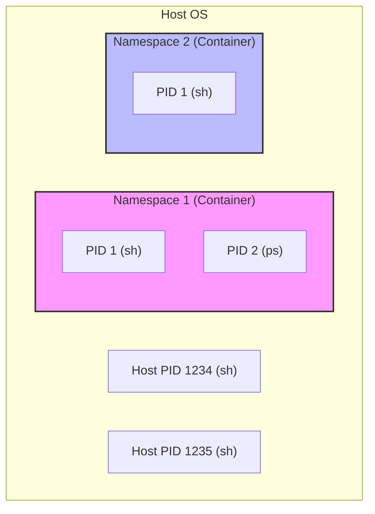
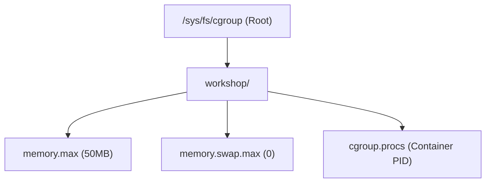
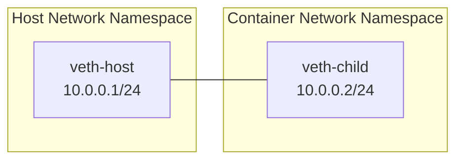

# Container Runtime Workshop: Understanding Containers through Namespaces and Cgroups

In this workshop, you will learn how containers are built and restricted by manually manipulating Linux's standard features: `namespaces` and `cgroups`. Finally, you will create your own (simple) container runtime using the Go language.

## Goals

- Understand process isolation by **namespaces** (PID, Mount, Network, etc.).
- Experience resource limiting mechanisms (CPU, Memory) using **cgroups (v2)**.
- Establish communication between an isolated network space and the host using a **veth** pair.
- Implement a container startup process using Go's `syscall` package.

---

## Prerequisites

- **OS:** Linux environment (Ubuntu 24.04 recommended). VM or cloud instances are assumed.
  - *Note: If you are on macOS or Windows, please run this on a Linux VM such as Ubuntu.*
- **Permissions:** Root (`sudo`) privileges are required.
- **Language:** Basic knowledge of Go.
- **Networking Knowledge:** Understanding of VLANs and networking basics learned in `./infra/vlan_ja.md` will deepen your understanding.

### Environment Verification

Run the following commands to ensure the necessary tools are installed.

```bash
# Check Podman (used for rootfs extraction)
podman --version

# Check Go
go version

# Check sudo privileges
sudo whoami
```

If any tools are missing, you can install them with:

```bash
sudo apt update
sudo apt install -y podman golang-go iproute2
```

---

## Step 1. Preparing the Root Filesystem (rootfs)

A container shares the host OS kernel but has its own filesystem. First, prepare the minimal filesystem that will serve as the "inside" of the container.

We will use the `alpine` Linux image here.

```bash
# Create working directory
mkdir -p ~/container-handson && cd ~/container-handson

# Pull Alpine image
podman pull alpine:latest

# Create a temporary container and export the filesystem
# The export command outputs the container's filesystem in tar format
podman create --name tmp-alpine alpine:latest
podman export tmp-alpine > rootfs.tar
podman rm tmp-alpine

# Extract to the rootfs directory
mkdir -p rootfs
tar -xf rootfs.tar -C rootfs

# Copy host DNS settings (required for name resolution inside the container)
cp /etc/resolv.conf rootfs/etc/resolv.conf

# Check contents
ls rootfs
```

You now have the standard Alpine Linux directory structure (`bin`, `etc`, `lib`, etc.) inside the `rootfs` directory.

---

## Step 2. Isolation with Namespaces

Linux `namespaces` are a feature that limits and isolates the system resources visible to a process. We will experience the following three main ones.



1. **PID Namespace:** Isolation of Process IDs.
2. **Mount Namespace:** Isolation of mount points (filesystem).
3. **Network Namespace:** Isolation of the network stack (NIC, IP, routing, etc.).

### 2-1. PID Namespace Isolation

You can use the `unshare` command to create new namespaces and execute a process.

```bash
# Start a shell with PID namespace isolated
# --fork: Start the shell as a new process instead of unshare itself
# --pid: Isolate the PID namespace
sudo unshare --pid --fork /bin/sh
```

**Verification inside the namespace:**

```bash
# Check Process ID
echo $$
# Result: 1 (Inside this namespace, the started shell becomes PID 1)

# Try running the ps command
ps
```

*Note: The `ps` command refers to the `/proc` directory, so at this stage, you will still see host processes. To solve this, we isolate the Mount namespace next.*

Exit the shell to return to the host.

```bash
exit
```

### 2-2. Mount Namespace and Root Change

Isolate the filesystem and make the prepared `rootfs` recognized as the container's root (`/`).

```bash
# Ensure you are in the working directory
cd ~/container-handson

# Start with PID and Mount namespaces isolated
sudo unshare --pid --fork --mount /bin/sh
```

**Verification inside the namespace:**

From here, these are operations within the isolated shell created by `unshare`.

```bash
# Check current directory (you should see rootfs)
ls
# Result: rootfs  rootfs.tar

# Change root to the previously prepared rootfs
# chroot [new root path] [command to execute]
chroot rootfs /bin/sh

# ---- Now inside rootfs (Alpine Linux) ----

# Ensure the mount point directory exists
mkdir -p /proc

# Mount /proc to make ps work correctly
# The Linux ps command gets information from the /proc directory.
# If this is not mounted, you cannot see the processes of the isolated space.
mount -t proc proc /proc

# Verify processes
ps
# Result:
# PID   USER     TIME  COMMAND
#    1 root      0:00  /bin/sh
#    2 root      0:00  /bin/sh
#    3 root      0:00  ps
```

Now you have a state close to a "container" where Process IDs and the filesystem are completely isolated.

Exit the shell (exit from chroot, then exit from unshare).

```bash
exit # Exit chroot
exit # Exit unshare
```

### 2-3. Network Namespace Isolation

Isolate the network stack.

```bash
# Start with Network namespace isolated
sudo unshare --net /bin/sh
```

**Verification inside the namespace:**

```bash
# Check network interfaces
ip link
# Result: Only lo (loopback) exists, and it is in DOWN state
```

In this state, communication with the host or the internet is impossible. We will learn how to establish communication in Step 4.

Exit the shell.

```bash
exit
```

---

## Step 3. Resource Control with Cgroups (v2)

While Namespaces limit "what you can see," Control Groups (**cgroups**) limit "how much resources (CPU, Memory, etc.) you can use."

In modern Linux (such as Ubuntu 24.04), **cgroups v2** is the standard. In cgroups v2, you can create a new group simply by creating a directory under `/sys/fs/cgroup`.

### 3-1. Creating a cgroup (v2) and Setting Limits

On the host side, create a group to limit resources. In cgroups v2, only resources (controllers) allowed in the parent directory can be limited in the child directory.



```bash
# 1. Enable memory controller in the parent directory (root)
# This allows memory limits to be used in child directories
echo "+memory" | sudo tee /sys/fs/cgroup/cgroup.subtree_control

# 2. Create your own cgroup directory
sudo mkdir -p /sys/fs/cgroup/workshop

# 3. Verify memory controller is enabled in the workshop directory
# It should contain the word "memory".
# If not, the echo "+memory" in Step 1 failed or is restricted by OS settings.
cat /sys/fs/cgroup/workshop/cgroup.controllers

# 4. Set memory limit to 50MB
echo 52428800 | sudo tee /sys/fs/cgroup/workshop/memory.max

# 5. Disable swap (important)
# If this is not done, processes will escape to the swap area when the limit is exceeded instead of being killed.
echo 0 | sudo tee /sys/fs/cgroup/workshop/memory.swap.max
```

### 3-2. Application and Verification to Container Process

#### 1. Prepare Isolated Process (Terminal 1)

Follow Step 2-2 to keep an isolated shell running.

```bash
cd ~/container-handson
sudo unshare --pid --fork --mount /bin/sh
# (Inside namespace)
chroot rootfs /bin/sh
mount -t proc proc /proc
```

#### 2. Apply Limits and Monitor from Host (Terminal 2)

From the host, start a "marker" process inside the container to identify the real Process ID (PID) of the shell running in the isolated space.

```bash
# (Terminal 1: Inside namespace)
# Start a marker process in the background
sleep 31337 &
```

Next, in Terminal 2 on the host, find the parent (PPID) of that process and register it in the cgroup.

```bash
# (Terminal 2: Host side)
# 1. Find sleep 31337 and get its parent (PPID)
SLEEP_PID=$(pgrep -f "sleep 31337")
TARGET_PID=$(ps -o ppid= -p $SLEEP_PID | xargs)
echo "Container Shell PID: $TARGET_PID"

# 2. Register the identified PID in the cgroup
echo $TARGET_PID | sudo tee /sys/fs/cgroup/workshop/cgroup.procs

# --- Start Monitoring ---
# Monitor current memory usage in another terminal or this one
# Observe it approaching 52428800 (50MB)
watch -n 0.1 "cat /sys/fs/cgroup/workshop/memory.current"
```

#### 3. Execute Memory Consumption (Terminal 1)

Consume memory inside the container. Using `bytearray` forces the OS to immediately allocate physical memory.

```bash
# (Inside namespace)
# The sleep process is no longer needed, so terminate it
# %1 refers to the first background job started in this shell
kill %1

# Allocate 1MB at a time and keep it in a list to ensure consumption
python3 -c "
import time
a = []
for i in range(100):
    try:
        a.append(bytearray(1024 * 1024))
        print(f'{i+1}MB allocated')
        time.sleep(0.05)
    except Exception as e:
        print(f'Error at {i}MB: {e}')
"
```

**Expected Result:**
The moment `memory.current` reaches 50MB in Terminal 2, the Python process in Terminal 1 will be `Killed` and stop.

Verify the OOM Kill occurrence in Terminal 2.

```bash
# Terminal 2 (Host)
cat /sys/fs/cgroup/workshop/memory.events
# If "oom_kill 1" is shown, the cgroup limit worked correctly.
# Example:
# $ cat /sys/fs/cgroup/workshop/memory.events
# low 0
# high 0
# max 36
# oom 1
# oom_kill 1
# oom_group_kill 0
```

After verification, clean up the cgroup.

```bash
# Terminate the shell if it hasn't finished, then delete
sudo rmdir /sys/fs/cgroup/workshop
```

---

## Step 4. Network Connection via Virtual Ethernet (veth)

As seen in Step 2-3, an isolated Network namespace cannot communicate with the outside. To bridge this, we use a **veth (virtual ethernet)** pair, which acts as a virtual LAN cable.



veth is always created in pairs; packets entering one end come out the other. By placing one end on the host and the other in the container (namespace), we enable communication.

### 4-1. Creating Network Namespace and Placing veth

To keep the experiment smooth, we create a named network namespace (`netns`) this time.

```bash
# 1. Create network namespace "container1"
sudo ip netns add container1

# 2. Create veth pair
# veth-host (host side) and veth-child (container side)
sudo ip link add veth-host type veth peer name veth-child

# 3. Move veth-child to namespace "container1"
sudo ip link set veth-child netns container1

# 4. Verification on host
# Confirm veth-host remains on host and veth-child has disappeared from host's list
ip link show | grep veth
# Result example:
# 4: veth-host@if3: <BROADCAST,MULTICAST> mtu 1500 qdisc noop state DOWN mode DEFAULT group default qlen 1000
# (veth-child is not shown here because it moved to the namespace)
```

### 4-2. Host Side Configuration

Enable the host-side interface and assign an IP address.

```bash
# Assign IP address
sudo ip addr add 10.0.0.1/24 dev veth-host

# Enable interface
sudo ip link set veth-host up

# Verification
# Confirm 10.0.0.1 is set and state is UP
ip addr show veth-host
```

### 4-3. Network Configuration and Communication from Inside Container

Next, from the isolated shell (inside the namespace) created in Step 2, configure your own network.

#### 1. Verification Inside Namespace (Terminal 1)

Start a shell isolating the Network namespace as in Step 2-3 (or use an already running one).

```bash
# (Terminal 1: Inside namespace)
# To keep it simple, use ip netns exec to run chroot inside the namespace.
cd ~/container-handson
sudo ip netns exec container1 chroot rootfs /bin/sh

# ---- Now inside the isolated shell ----

# Check your network interfaces
# You should see veth-child moved from the host side
ip link
# Example: It is still DOWN
# 5: veth-child@if6: <BROADCAST,MULTICAST,M-DOWN> mtu 1500 qdisc noop state DOWN qlen 1000
#     link/ether d6:65:38:4e:0b:52 brd ff:ff:ff:ff:ff:ff
```

#### 2. Interface Enabling and IP Assignment (Terminal 1)

```bash
# (Inside namespace)
# Enable your own interface and set IP
ip addr add 10.0.0.2/24 dev veth-child
ip link set veth-child up
ip link set lo up
# Verification: It is UP
ip link
# 5: veth-child@if6: <BROADCAST,MULTICAST,UP,LOWER_UP,M-DOWN> mtu 1500 qdisc noqueue state UP qlen 1000
#     link/ether d6:65:38:4e:0b:52 brd ff:ff:ff:ff:ff:ff
```

#### 3. Listening for Messages (Terminal 1)

Use the **nc (netcat)** command, which is useful for network debugging, inside the container.

```bash
# (Inside namespace)
# Wait for messages on port 8080
nc -l -p 8080
```

#### 4. Sending from Host (Terminal 2)

From another terminal, send a message to the container's IP (`10.0.0.2`).

```bash
# (Terminal 2: Host side)
echo "Hello to Container inside Namespace!" | nc 10.0.0.2 8080
```

**Expected Result:**
The message is displayed in Terminal 1 (inside the container).

This confirms that the container has "independent network settings (IP and NIC) from the host" and can communicate with the host through a virtual cable.

After verification, exit the container and delete network settings on the host.

```bash
# (Inside namespace)
ctrl-c # Terminate nc
exit # Exit unshare
```

```bash
# Run on Host side
sudo ip link delete veth-host
sudo ip netns del container1
```

---

## Step 5. Implementing Container in Go

So far, we have manually built isolated spaces using Linux commands, but actual container runtimes (Docker, Podman, containerd, etc.) achieve these by calling system calls from within programs.

Using Go's `os/exec` and `syscall` packages, we will create a minimal program that reproduces the isolation process performed in Step 2.

### 5-1. Creating the Go Program

Create `main.go` in your working directory.

```go
package main

import (
 "fmt"
 "os"
 "os/exec"
 "syscall"
)

func main() {
 // Branch processing based on execution arguments
 // "run" to start the container, "child" to execute inside isolated space
 switch os.Args[1] {
 case "run":
  run()
 case "child":
  child()
 default:
  panic("invalid command")
 }
}

func run() {
 fmt.Printf("Running %v as PID %d\n", os.Args[2:], os.Getpid())

 // Re-execute itself with "child" argument
 // Set Cloneflags to create new namespaces at that time
 cmd := exec.Command("/proc/self/exe", append([]string{"child"}, os.Args[2:]...)...)
 cmd.Stdin = os.Stdin
 cmd.Stdout = os.Stdout
 cmd.Stderr = os.Stderr

 // Namespace isolation settings
 cmd.SysProcAttr = &syscall.SysProcAttr{
  Cloneflags: syscall.CLONE_NEWUTS | // Hostname isolation
     syscall.CLONE_NEWPID | // PID isolation
     syscall.CLONE_NEWNS | // Mount point isolation
     syscall.CLONE_NEWNET, // Network isolation
 }

 if err := cmd.Run(); err != nil {
  fmt.Printf("Error running child: %v\n", err)
  os.Exit(1)
 }
}

func child() {
 fmt.Printf("Running child %v as PID %d\n", os.Args[2:], os.Getpid())

 // 1. Change root filesystem (chroot)
 if err := syscall.Chroot("rootfs"); err != nil {
  panic(err)
 }
 if err := os.Chdir("/"); err != nil {
  panic(err)
 }

 // 2. Mount /proc
 // This makes only processes inside the container visible
 if err := syscall.Mount("proc", "proc", "proc", 0, ""); err != nil {
  fmt.Printf("Error mounting proc: %v\n", err)
 }

 // 3. Execute specified command (replace current process)
 // Since it's after chroot, the path must be treated as an absolute path from "/" in rootfs.
 // syscall.Exec(path, args, env)
 // - path: Path to the executable binary
 // - args: Slice of arguments including the program name
 // - env: Slice of environment variables
 command := os.Args[2]
 if err := syscall.Exec(command, os.Args[2:], os.Environ()); err != nil {
  fmt.Printf("Error executing %s: %v\n", command, err)
  os.Exit(1)
 }
}
```

### 5-2. Execution and Verification

Building is recommended before execution to avoid PID shifts caused by the Go build process when using `go run`.

```bash
# Build
go build -o mycontainer main.go

# Start sh as a container
sudo ./mycontainer run /bin/sh
```

**Verification inside the container:**

```bash
# Verify Process ID (should be PID 1)
echo $$
1

# Verify isolated filesystem
ls /

# Verify process list
ps
```

### Code Explanation

- **`Cloneflags`**: By passing `syscall.CLONE_NEW...` flags, you specify which resources to isolate when creating a new process.
- **`Chroot`**: Performs the root change manually done in Step 2-2 using a system call.
- **`/proc/self/exe`**: Points to your own binary currently being executed. The technique of restarting yourself as "PID 1 inside the container" after configuring namespace settings is used in actual container runtimes.

---

## Summary

Through this workshop, you have learned:

1. **Containers are not magic**: They are nothing more than "restricted processes" realized by combining existing Linux kernel features such as `namespaces` and `cgroups`.
2. **Filesystem Isolation**: You can artificially create an OS environment (such as Alpine) different from the host by preparing `chroot` and root directories.
3. **Network Virtualization**: Using `veth` pairs, you can run a "pipe" into the isolated space and establish a communication path with the outside.
4. **Control via Programs**: By utilizing system calls, you can automate these operations and build a safe, reproducible execution environment (runtime).

Having understood the true nature of containers, you may now feel that the vast features provided by Docker and Kubernetes are actually built upon the accumulation of these gritty, low-layer technologies.

---

## Next Steps

If you want to dive deeper, try these topics:

- **Capability Restriction**: Limit the privileges (Capabilities) a process inside the container can have using `syscall.RawSyscall` or similar.
- **Introducing OverlayFS**: Reproduce the layer structure of images using OverlayFS, which overlays multiple directories to look like a single filesystem.
- **OCI Runtime Specification**: Read the [OCI Runtime Specification](https://github.com/opencontainers/runtime-spec) followed by standard container runtimes like `runc` and try to bring your implementation closer to it.
- **Network Bridge**: Connect multiple containers to a single bridge to establish container-to-container communication.
