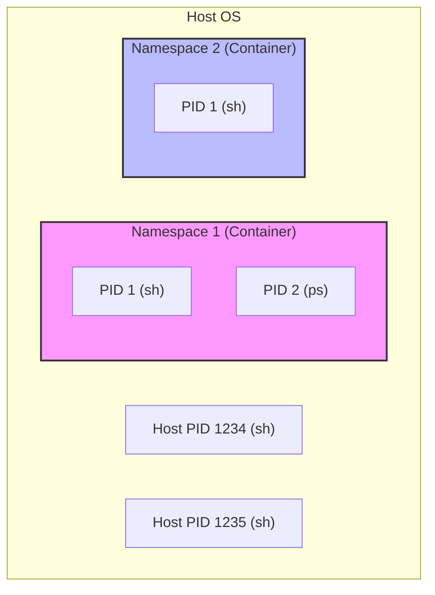
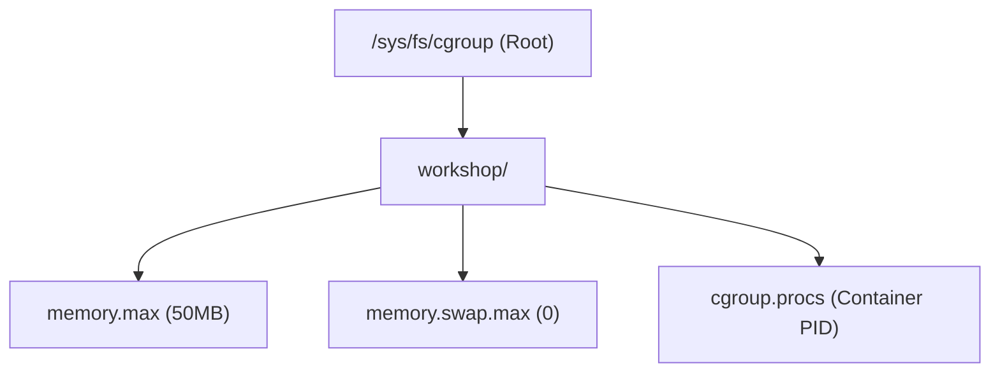
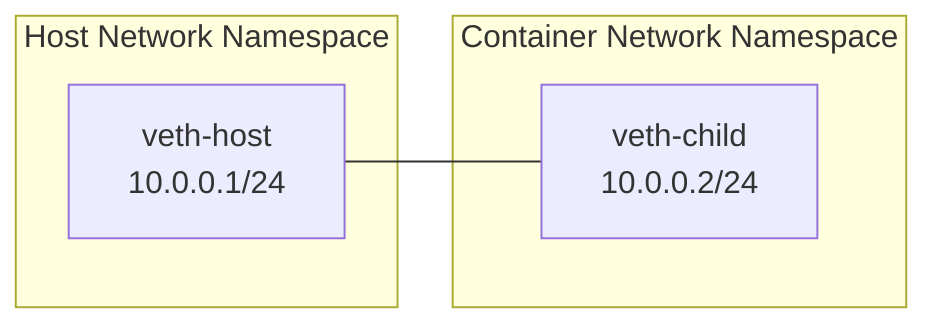

# コンテナランタイム実習：namespaces と cgroups で理解するコンテナの正体

このワークショップでは、Linux の標準機能である `namespaces` と `cgroups` を手動で操作し、コンテナがどのように構築・制限されているかを学びます。最終的に、Go 言語を使用して独自の（簡易的な）コンテナランタイムを作成します。

## ゴール

- **namespaces** によるプロセスの隔離（PID, Mount, Network など）を理解する。
- **cgroups (v2)** によるリソース制限（CPU, メモリ）の仕組みを体験する。
- **veth** ペアを使用して、隔離されたネットワーク空間とホスト間の通信を確立する。
- Go 言語の `syscall` パッケージを使用して、コンテナの起動プロセスを実装する。

---

## 前提条件

- **OS:** Linux 環境（Ubuntu 24.04 推奨）。VM やクラウド上のインスタンスを想定しています。
  - ※ macOS や Windows の場合は、Ubuntu などの Linux VM 上で実行してください。
- **権限:** `sudo` によるルート権限が必要です。
- **言語:** Go 言語の基本的な知識。
- **ネットワーク知識:** `./infra/vlan_ja.md` で学んだ VLAN やネットワークの基礎知識があると理解が深まります。

### 環境確認

以下のコマンドを実行して、必要なツールがインストールされているか確認してください。

```bash
# Podman の確認 (rootfs 抽出に使用)
podman --version

# Go の確認
go version

# sudo 権限の確認
sudo whoami
```

ツールが足りない場合は、以下のコマンドでインストールできます。

```bash
sudo apt update
sudo apt install -y podman golang-go iproute2
```

---

## Step 1. ルートファイルシステム (rootfs) の準備

コンテナは、ホストの OS カーネルを共有しつつ、独自のファイルシステムを持ちます。まずは、コンテナの「中身」となる最小限のファイルシステムを用意します。

ここでは `alpine` Linux のイメージを使用します。

```bash
# 作業ディレクトリの作成
mkdir -p ~/container-handson && cd ~/container-handson

# Alpine イメージの取得
podman pull alpine:latest

# 一時的なコンテナを作成し、ファイルシステムをエクスポートする
# export コマンドはコンテナのファイルシステムを tar 形式で出力します
podman create --name tmp-alpine alpine:latest
podman export tmp-alpine > rootfs.tar
podman rm tmp-alpine

# rootfs ディレクトリに展開
mkdir -p rootfs
tar -xf rootfs.tar -C rootfs

# ホストの DNS 設定をコピー (これがないとコンテナ内で名前解決ができません)
cp /etc/resolv.conf rootfs/etc/resolv.conf

# 中身を確認
ls rootfs
```

これで、`rootfs` ディレクトリの中に Alpine Linux の標準的なディレクトリ構造（`bin`, `etc`, `lib` など）が作成されました。

---

## Step 2. 名前空間 (Namespaces) による隔離

Linux の `namespaces` は、プロセスから見えるシステムリソースを制限・隔離する機能です。主要なものとして、以下の 3 つを体験します。



1. **PID Namespace:** プロセス ID の隔離。
2. **Mount Namespace:** マウントポイント（ファイルシステム）の隔離。
3. **Network Namespace:** ネットワークスタック（NIC, IP, ルーティングなど）の隔離。

### 2-1. PID 名前空間の隔離

`unshare` コマンドを使用すると、新しい名前空間を作成してプロセスを実行できます。

```bash
# PID 名前空間を分離して shell を起動
# --fork: unshare 自身ではなく、新しいプロセスとしてシェルを起動する
# --pid: PID 名前空間を分離する
sudo unshare --pid --fork /bin/sh
```

**名前空間内での確認:**

```bash
# プロセス ID を確認
echo $$
# 結果: 1 (この名前空間内では、起動したシェルが PID 1 になる)

# ps コマンドを実行してみる
ps
```

※ `ps` コマンドは `/proc` ディレクトリを参照するため、この段階ではホストのプロセスが見えてしまいます。これを解決するために、次に Mount 名前空間を隔離します。

シェルを終了してホストに戻ります。

```bash
exit
```

### 2-2. Mount 名前空間とルートの変更

ファイルシステムを隔離し、用意した `rootfs` をコンテナのルート (`/`) として認識させます。

```bash
# 作業ディレクトリに移動していることを確認
cd ~/container-handson

# PID と Mount 名前空間を分離して起動
sudo unshare --pid --fork --mount /bin/sh
```

**名前空間内での確認:**

ここからは、`unshare` で作成された隔離空間内のシェルでの操作です。

```bash
# 現在のディレクトリを確認 (rootfs が見えるはず)
ls
# 結果: rootfs  rootfs.tar

# 先ほど用意した rootfs にルートを変更する
# chroot [新しいルートのパス] [実行するコマンド]
chroot rootfs /bin/sh

# ---- ここからは rootfs (Alpine Linux) の中 ----

# マウントポイントとなるディレクトリが存在することを確認
mkdir -p /proc

# ps を正しく動作させるために /proc をマウントする
# Linux の ps コマンドは /proc ディレクトリから情報を取得します。
# これをマウントしないと、隔離された空間のプロセスが見えません。
mount -t proc proc /proc

# プロセスを確認
ps
# 結果:
# PID   USER     TIME  COMMAND
#    1 root      0:00  /bin/sh
#    2 root      0:00  /bin/sh
#    3 root      0:00  ps
```

これで、プロセス ID とファイルシステムが完全に隔離された「コンテナ」に近い状態になりました。

シェルを終了します（chroot から exit し、unshare からも exit します）。

```bash
exit # chroot を抜ける
exit # unshare を抜ける
```

### 2-3. Network 名前空間の隔離

ネットワークスタックを隔離します。

```bash
# Network 名前空間を分離して起動
sudo unshare --net /bin/sh
```

**名前空間内での確認:**

```bash
# ネットワークインタフェースを確認
ip link
# 結果: lo (ループバック) しか存在せず、しかも DOWN 状態
```

この状態では、ホストやインターネットと通信することはできません。通信を確立する方法は、Step 4 で学びます。

シェルを終了します。

```bash
exit
```

---

## Step 3. リソース制限 (Cgroups v2) による制御

名前空間 (Namespaces) が「何が見えるか」を制限するのに対し、コントロールグループ (**cgroups**) は「どれだけのリソース（CPU, メモリなど）を使えるか」を制限します。

現代の Linux (Ubuntu 24.04 など) では **cgroups v2** が標準です。cgroups v2 では、`/sys/fs/cgroup` 配下にディレクトリを作成するだけで、新しいグループを作成できます。

### 3-1. cgroup (v2) の作成と制限の設定

ホスト側で、リソースを制限するためのグループを作成します。cgroup v2 では、親ディレクトリで許可されたリソース（コントローラー）のみが子ディレクトリで制限可能です。



```bash
# 1. 親ディレクトリ (root) でメモリコントローラーを有効化
# これにより、配下の子ディレクトリでメモリ制限が使えるようになります
echo "+memory" | sudo tee /sys/fs/cgroup/cgroup.subtree_control

# 2. 独自の cgroup ディレクトリを作成
sudo mkdir -p /sys/fs/cgroup/workshop

# 3. workshop ディレクトリでメモリコントローラーが有効であることを確認
# ここに "memory" という文字が含まれている必要があります。
# もし含まれていない場合、Step 1 の echo "+memory" が失敗しているか、OSの設定で制限されています。
cat /sys/fs/cgroup/workshop/cgroup.controllers

# 4. メモリ制限を 50MB に設定
echo 52428800 | sudo tee /sys/fs/cgroup/workshop/memory.max

# 5. スワップを禁止する (重要)
# これを行わないと、メモリ上限を超えてもスワップ領域に逃げてしまい、プロセスが Kill されません
echo 0 | sudo tee /sys/fs/cgroup/workshop/memory.swap.max
```

### 3-2. コンテナプロセスへの適用と検証

#### 1. 隔離プロセスの準備 (ターミナル 1)

Step 2-2 の手順で、隔離されたシェルを起動したままにします。

```bash
cd ~/container-handson
sudo unshare --pid --fork --mount /bin/sh
# (名前空間内)
chroot rootfs /bin/sh
mount -t proc proc /proc
```

#### 2. ホスト側から制限を適用と監視 (ターミナル 2)

ホスト側から、隔離空間で動いているシェルの実プロセス ID (PID) を特定するために、コンテナ内で「目印」となるプロセスを起動します。

```bash
# (ターミナル 1: 名前空間内)
# 目印となるプロセスをバックグラウンドで起動
sleep 31337 &
```

次に、ホスト側のターミナル 2 でそのプロセスの親を探し、cgroup に登録します。

```bash
# (ターミナル 2: ホスト側)
# 1. sleep 31337 を探し、その親 (PPID) を取得する
SLEEP_PID=$(pgrep -f "sleep 31337")
TARGET_PID=$(ps -o ppid= -p $SLEEP_PID | xargs)
echo "Container Shell PID: $TARGET_PID"

# 2. 特定した PID を cgroup に登録
echo $TARGET_PID | sudo tee /sys/fs/cgroup/workshop/cgroup.procs

# --- 監視を開始 ---
# 別のターミナル、またはこのターミナルで現在のメモリ使用量を監視します
# 52428800 (50MB) に近づく様子を観察してください
watch -n 0.1 "cat /sys/fs/cgroup/workshop/memory.current"
```

#### 3. メモリ消費の実行 (ターミナル 1)

コンテナ内でメモリを消費します。`bytearray` を使うことで、OS に即座に物理メモリの割り当てを強制します。

```bash
# (名前空間内)
# 先ほど起動した sleep はもう不要なので終了させておきます
# %1 は、このシェルで 1 番目に起動したバックグラウンドジョブを指します
kill %1

# 1MB ずつ確保し、リストに保持し続けることで確実にメモリを消費します
python3 -c "
import time
a = []
for i in range(100):
    try:
        a.append(bytearray(1024 * 1024))
        print(f'{i+1}MB allocated')
        time.sleep(0.05)
    except Exception as e:
        print(f'Error at {i}MB: {e}')
"
```

**期待される結果:**
ターミナル 2 の `memory.current` が 50MB に達した瞬間、ターミナル 1 の Python プロセスが `Killed` となり停止します。

ターミナル 2 で OOM Kill の発生を確認します。

```bash
# ターミナル 2 (ホスト)
cat /sys/fs/cgroup/workshop/memory.events
# "oom_kill 1" となっていれば、cgroup の制限が正しく機能した証拠です
# 例:
# $ cat /sys/fs/cgroup/workshop/memory.events
# low 0
# high 0
# max 36
# oom 1
# oom_kill 1
# oom_group_kill 0
```

確認が終わったら、cgroup を掃除します。

```bash
# シェルが終了していない場合は終了させてから削除
sudo rmdir /sys/fs/cgroup/workshop
```

---

## Step 4. 仮想イーサネット (veth) によるネットワーク接続

Step 2-3 で見た通り、隔離された Network 名前空間は外部と通信できません。これをつなぐために、仮想的な LAN ケーブルである **veth (virtual ethernet)** ペアを使用します。



veth は常にペアで作成され、一方に入力されたパケットはもう一方から出てきます。これを利用して、一方をホスト側に、もう一方をコンテナ（名前空間）側に配置することで通信を可能にします。

### 4-1. ネットワーク名前空間の作成と veth の配置

実験をスムーズに進めるため、今回は名前を付けたネットワーク名前空間 (`netns`) を作成します。

```bash
# 1. ネットワーク名前空間 "container1" を作成
sudo ip netns add container1

# 2. veth ペアを作成
# veth-host (ホスト側) と veth-child (コンテナ側)
sudo ip link add veth-host type veth peer name veth-child

# 3. veth-child を名前空間 "container1" に移動
sudo ip link set veth-child netns container1

# 4. ホスト側での確認
# veth-host がホスト側に残り、veth-child がホストの一覧から消えていることを確認します
ip link show | grep veth
# 結果例:
# 4: veth-host@if3: <BROADCAST,MULTICAST> mtu 1500 qdisc noop state DOWN mode DEFAULT group default qlen 1000
# (veth-child は名前空間に移動したため、ここには表示されません)
```

### 4-2. ホスト側の設定

ホスト側のインターフェースを有効化し、IP アドレスを割り当てます。

```bash
# IP アドレスの割り当て
sudo ip addr add 10.0.0.1/24 dev veth-host

# インターフェースの有効化
sudo ip link set veth-host up

# 確認
# 10.0.0.1 が設定され、state が UP になっていることを確認します
ip addr show veth-host
```

### 4-3. コンテナ内からのネットワーク設定と通信

次に、Step 2 で作成した隔離シェル（名前空間内）から、自分に割り当てられたネットワークを設定します。

#### 1. 名前空間内での確認 (ターミナル 1)

Step 2-3 と同様に、Network 名前空間を分離してシェルを起動します（既に起動している場合はそれを使います）。

```bash
# (ターミナル 1: 名前空間内)
# ※ 既に起動しているシェルが container1 名前空間に紐付いている必要があります。
# 実習をシンプルにするため、ここでは ip netns exec を使って名前空間内で chroot を実行します。
cd ~/container-handson
sudo ip netns exec container1 chroot rootfs /bin/sh

# ---- ここからは隔離されたシェルの中 ----

# 自分のネットワークインターフェースを確認
# 先ほどホスト側から移動させた veth-child が見えるはずです
ip link
# 例: まだ DOWN しています
# 5: veth-child@if6: <BROADCAST,MULTICAST,M-DOWN> mtu 1500 qdisc noop state DOWN qlen 1000
#     link/ether d6:65:38:4e:0b:52 brd ff:ff:ff:ff:ff:ff
```

#### 2. インターフェースの有効化と IP 割り当て (ターミナル 1)

```bash
# (名前空間内)
# 自分自身のインターフェースを有効にし、IP を設定する
ip addr add 10.0.0.2/24 dev veth-child
ip link set veth-child up
ip link set lo up
# 確認: UP しています
ip link
# 5: veth-child@if6: <BROADCAST,MULTICAST,UP,LOWER_UP,M-DOWN> mtu 1500 qdisc noqueue state UP qlen 1000
#     link/ether d6:65:38:4e:0b:52 brd ff:ff:ff:ff:ff:ff
```

#### 3. メッセージの待ち受け (ターミナル 1)

コンテナ内で、ネットワークのデバッグに便利な **nc (netcat)** コマンドを使用します。

```bash
# (名前空間内)
# 8080 ポートでメッセージを待機
nc -l -p 8080
```

#### 4. ホスト側から送信 (ターミナル 2)

別のターミナルから、コンテナの IP (`10.0.0.2`) へメッセージを送信します。

```bash
# (ターミナル 2: ホスト側)
echo "Hello to Container inside Namespace!" | nc 10.0.0.2 8080
```

**期待される結果:**
ターミナル 1（コンテナの中）にメッセージが表示されます。

これにより、コンテナが「ホストとは独立したネットワーク設定（IP や NIC）」を持ち、ホスト側と仮想的なケーブルで通信できていることが確認できました。

確認が終わったら、コンテナをexitで抜け、hostでネットワーク設定を削除します。

```bash
# (名前空間内)
ctrl-c # nc を終了
exit # unshare を抜ける
```

```bash
# ホスト側で実行
sudo ip link delete veth-host
sudo ip netns del container1
```

---

## Step 5. Go 言語によるコンテナの実装

これまでは Linux コマンドを使用して手動で隔離空間を構築してきましたが、実際のコンテナランタイム（Docker, Podman, containerd など）は、これらをプログラム内からシステムコールを呼び出すことで実現しています。

Go 言語の `os/exec` および `syscall` パッケージを使用して、Step 2 で行った隔離処理を再現する最小限のプログラムを作成します。

### 5-1. Go プログラムの作成

作業ディレクトリに `main.go` を作成します。

```go
package main

import (
 "fmt"
 "os"
 "os/exec"
 "syscall"
)

func main() {
 // 実行引数に応じて処理を分岐
 // コンテナを起動する "run" と、隔離空間内で実行される "child"
 switch os.Args[1] {
 case "run":
  run()
 case "child":
  child()
 default:
  panic("invalid command")
 }
}

func run() {
 fmt.Printf("Running %v as PID %d\n", os.Args[2:], os.Getpid())

 // 自分自身を "child" 引数で再実行する
 // その際、Cloneflags を設定して新しい名前空間を作成する
 cmd := exec.Command("/proc/self/exe", append([]string{"child"}, os.Args[2:]...)...)
 cmd.Stdin = os.Stdin
 cmd.Stdout = os.Stdout
 cmd.Stderr = os.Stderr

 // 名前空間の分離設定
 cmd.SysProcAttr = &syscall.SysProcAttr{
  Cloneflags: syscall.CLONE_NEWUTS | // ホスト名の分離
   syscall.CLONE_NEWPID | // プロセスIDの分離
   syscall.CLONE_NEWNS | // マウントポイントの分離
   syscall.CLONE_NEWNET, // ネットワークの分離
 }

 if err := cmd.Run(); err != nil {
  fmt.Printf("Error running child: %v\n", err)
  os.Exit(1)
 }
}

func child() {
 fmt.Printf("Running child %v as PID %d\n", os.Args[2:], os.Getpid())

 // 1. ルートファイルシステムの変更 (chroot)
 if err := syscall.Chroot("rootfs"); err != nil {
  panic(err)
 }
 if err := os.Chdir("/"); err != nil {
  panic(err)
 }

 // 2. /proc のマウント
 // これにより、コンテナ内のプロセスだけが見えるようになる
 if err := syscall.Mount("proc", "proc", "proc", 0, ""); err != nil {
  fmt.Printf("Error mounting proc: %v\n", err)
 }

 // 3. 指定されたコマンドの実行 (現在のプロセスを置き換える)
 // chroot 後なので、パスは "/" から始まる rootfs 内のパスとして扱う必要があります。
 // syscall.Exec(path, args, env)
 // - path: 実行バイナリのパス
 // - args: プログラム名を含む引数のスライス
 // - env: 環境変数のスライス
 command := os.Args[2]
 if err := syscall.Exec(command, os.Args[2:], os.Environ()); err != nil {
  fmt.Printf("Error executing %s: %v\n", command, err)
  os.Exit(1)
 }
}
```

### 5-2. 実行と動作確認

`go run` で実行すると、Go のビルドプロセスが介在し PID がずれることがあるため、一度バイナリとしてビルドしてから実行することを推奨します。

```bash
# ビルド
go build -o mycontainer main.go

# コンテナとして sh を起動
sudo ./mycontainer run /bin/sh
```

**コンテナ内での確認:**

```bash
# プロセス ID の確認 (PID 1 になっているはず)
echo $$
1

# 隔離されたファイルシステムの確認
ls /

# プロセス一覧の確認
ps
```

### コードの解説

- **`Cloneflags`**: `syscall.CLONE_NEW...` フラグを渡すことで、新しいプロセスを作成する際にどのリソースを隔離するかを指定しています。
- **`Chroot`**: Step 2-2 で手動で行ったルート変更をシステムコールで実行しています。
- **`/proc/self/exe`**: 現在実行中の自分自身のバイナリを指します。一度名前空間の設定を行ってから自分自身を「コンテナ内の PID 1」として再起動する手法は、実際のコンテナランタイムでも使われているテクニックです。

---

## まとめ

このワークショップを通じて、以下のことを学びました。

1. **コンテナは魔法ではない**: Linux カーネルが持つ `namespaces` や `cgroups` といった既存の機能を組み合わせて実現されている「制限されたプロセス」に過ぎません。
2. **ファイルシステムの分離**: `chroot` やルートディレクトリの準備によって、ホストとは異なる OS 環境（Alpine など）を擬似的に作り出せます。
3. **ネットワークの仮想化**: `veth` ペアを使うことで、隔離された空間に「土管」を通し、外部との通信路を確立できます。
4. **プログラムによる制御**: システムコールを利用することで、これらの操作を自動化し、安全で再現性の高い実行環境（ランタイム）を構築できます。

コンテナの正体を理解したことで、Docker や Kubernetes が提供している膨大な機能が、実はこれらの泥臭い低レイヤー技術の積み重ねの上に成り立っていることが実感できたのではないでしょうか。

---

## 次のステップ

さらに深く学びたい方は、以下のトピックに挑戦してみてください。

- **Capability の制限**: `syscall.RawSyscall` などを使用して、コンテナ内のプロセスが持てる権限 (Capabilities) を制限する。
- **OverlayFS の導入**: 複数のディレクトリを重ね合わせて 1 つのファイルシステムに見せる OverlayFS を使用して、イメージのレイヤー構造を再現する。
- **OCI ランタイム仕様**: `runc` などの標準的なコンテナランタイムが準拠している [OCI Runtime Specification](https://github.com/opencontainers/runtime-spec) を読み、実装を近づけてみる。
- **ネットワークブリッジ**: 複数のコンテナを 1 つのブリッジに繋ぎ、コンテナ間通信を構築する。
