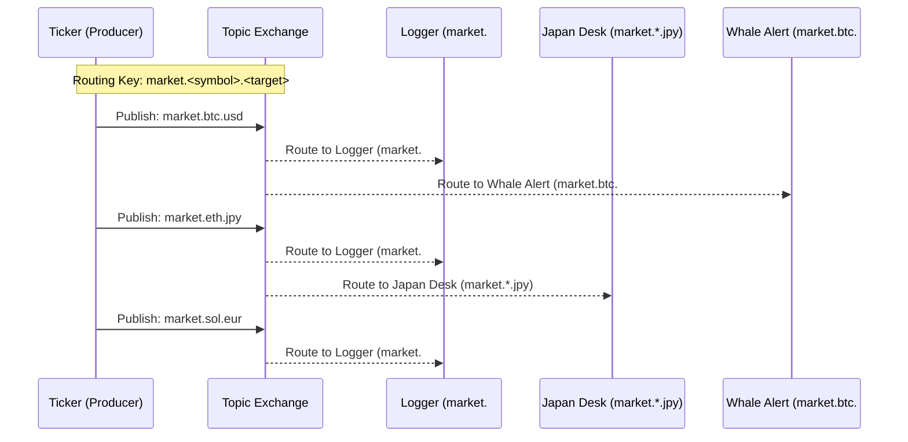
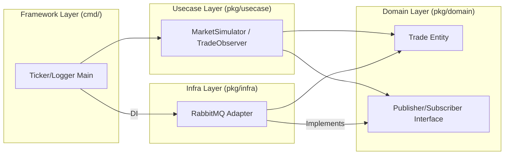

# RabbitMQ Workshop: Real-time Crypto Monitoring System with Topic Exchange

In this workshop, you will build a system that flexibly filters and processes a vast stream of real-time cryptocurrency trade data (Ticker) using the powerful **Topic Exchange** feature of **RabbitMQ**.

## Goals

You will build a monitoring system based on **Clean Architecture** with the following features:



1.  **Ticker (Publisher):** Generates random trade data and publishes it with a Routing Key in the format `market.<currency>.<target_currency>`.
2.  **Logger (All-records):** Subscribes to `market.#` and logs every transaction.
3.  **Japan Desk (JPY-pair Monitoring):** Subscribes to `market.*.jpy` and extracts only Japanese Yen transactions.
4.  **Whale Alert (Large Trade Detection):** Subscribes to `market.btc.#` and detects significant Bitcoin transactions.

---

## Architecture

This system completely decouples the "Sender (Producer)" and the "Receiver (Consumer)" by placing RabbitMQ in between, achieving a loosely coupled design.

### Layer Structure and Dependencies



### Layer Structure and Directory

```text
infra/assets/rabbitmq_crypto/
├── cmd/                        # Framework Layer (Entry Points)
│   ├── ticker/                 # Trade data generation & distribution
│   ├── logger/                 # All-records logging
│   ├── alert/                  # Whale alert
│   └── japandesk/              # JPY monitoring
└── pkg/
    ├── domain/                 # Domain Layer (Entity, Interface)
    ├── usecase/                # Usecase Layer (Business Logic)
    └── infra/                  # Infra Layer (RabbitMQ Adapter)
```

-   **Topic Exchange (`crypto_market`):** Controls the message "destination" using dot-separated keywords (e.g., `market.btc.usd`).
-   **Routing Key:** A label attached at the time of sending.
-   **Binding Key:** A pattern specified by the receiver to define "which labels of messages it wants."
    -   `*`: Matches exactly one word.
    -   `#`: Matches zero or more words.

---

## Preparation

### 1. Start RabbitMQ

Start the RabbitMQ instance for the workshop. We use an image that includes the Management Plugin.

```bash
cd infra/assets/rabbitmq_crypto
make mq-up
```

After starting, you can visualize the message flow by accessing [http://localhost:15672](http://localhost:15672) (guest/guest) in your browser.

### 2. Install Dependencies

```bash
go mod tidy
```

---

## Workshop Steps

### STEP 1: Stream Market Data (Ticker)

First, start the `ticker` which continuously generates trade data.

```bash
go run cmd/ticker/main.go
```

This program publishes messages to RabbitMQ every 500ms with keys like `market.eth.jpy` or `market.btc.usd`. At this point, messages are discarded as there are no receivers.

### STEP 2: Log All Transactions (Topic: `market.#`)

Open another terminal and start the `logger` to catch all messages.

```bash
go run cmd/logger/main.go
```

Since it uses the `#` wildcard, data for all currency pairs will be displayed.

### STEP 3: Conditional Filtering (Topic: `market.*.jpy` / `market.btc.#`)

Open even more terminals and start consumers that match specific conditions.

-   **Display only JPY-denominated transactions:**
    ```bash
    go run cmd/japandesk/main.go
    ```
-   **Monitor only large Bitcoin transactions (> 3.0 BTC):**
    ```bash
    go run cmd/alert/main.go
    ```

Notice how RabbitMQ "copies and distributes" messages appropriately according to the receiver's Binding Key without changing a single line of the sender's code.

---

## Clean Architecture Highlights

In this workshop, the code communicates with RabbitMQ through the interface defined in `pkg/domain/repository.go`.

```go
type TradePublisher interface {
    Publish(ctx context.Context, trade Trade) error
}
```

This allows you to swap the message broker for Kafka or Google Cloud Pub/Sub in the future without modifying any business logic in `pkg/usecase` responsible for "generating trades" or "monitoring trades."

---

## Cleanup

When you are finished with the workshop, stop and remove the container.

```bash
make mq-down
```
