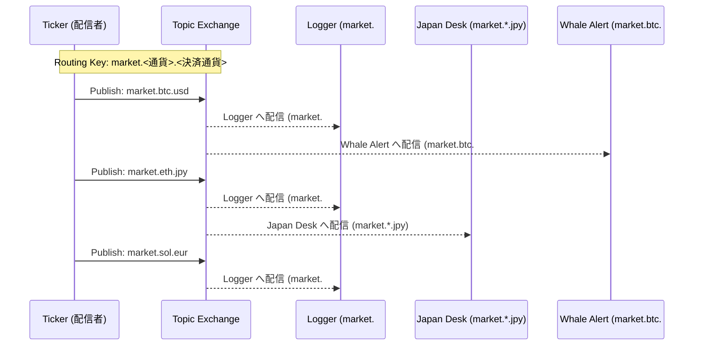
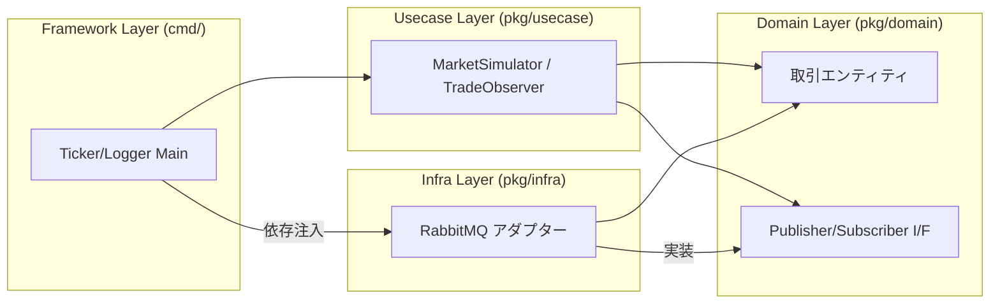

# RabbitMQ 実習：Topic Exchange で作るリアルタイム・仮想通貨監視システム

この実習では、メッセージブローカー **RabbitMQ** の強力な機能である **Topic Exchange** を使用して、リアルタイムに流れる膨大な仮想通貨の取引データ（Ticker）を、複数の用途に合わせて柔軟にフィルタリング・処理するシステムを構築します。

## ゴール

以下の機能を備えた監視システムを **Clean Architecture** に基づいて構築します。



1. **Ticker (配信者):** ランダムな取引データを生成し、`market.<通貨>.<決済通貨>` という形式の Routing Key で配信。
2. **Logger (全件記録):** `market.#` を購読し、すべての取引をログ出力。
3. **Japan Desk (円建て監視):** `market.*.jpy` を購読し、日本円の取引のみを抽出。
4. **Whale Alert (大口検知):** `market.btc.#` を購読し、Bitcoin の大きな取引を検知。

---

## アーキテクチャ

本システムは、メッセージの「送信者（Producer）」と「受信者（Consumer）」を完全に分離し、間に RabbitMQ を挟むことで疎結合な設計を実現しています。

### レイヤー構造と依存関係



### レイヤー構造とディレクトリ

```text
infra/assets/rabbitmq_crypto/
├── cmd/                        # Framework Layer (Entry Points)
│   ├── ticker/                 # 取引データの生成・配信
│   ├── logger/                 # 全件記録
│   ├── alert/                  # 大口アラート
│   └── japandesk/              # 日本円監視
└── pkg/
    ├── domain/                 # Domain Layer (Entity, Interface)
    ├── usecase/                # Usecase Layer (Business Logic)
    └── infra/                  # Infra Layer (RabbitMQ Adapter)
```

- **Topic Exchange (`crypto_market`):** メッセージの「宛先」をドット区切りのキーワード（例：`market.btc.usd`）で制御します。
- **Routing Key:** 送信時に付与するラベル。
- **Binding Key:** 受信側が「どのラベルのメッセージが欲しいか」を指定するパターン。
  - `*`: ちょうど1つの単語にマッチ。
  - `#`: 0個以上の単語にマッチ。

---

## 準備

### 1. RabbitMQ の起動

実習用の RabbitMQ を起動します。管理画面（Management Plugin）が含まれるイメージを使用します。

```bash
cd infra/assets/rabbitmq_crypto
make mq-up
```

起動後、ブラウザで [http://localhost:15672](http://localhost:15672) (guest/guest) にアクセスすると、メッセージの流れを可視化できます。

### 2. 依存ライブラリのインストール

```bash
go mod tidy
```

---

## 実習ステップ

### STEP 1: 市場データの配信 (Ticker)

まず、取引データを生成し続ける `ticker` を起動します。

```bash
go run cmd/ticker/main.go
```

このプログラムは 500ms ごとに `market.eth.jpy` や `market.btc.usd` といったキーでメッセージを RabbitMQ に投げ続けます。この時点では受け取り手がいないため、メッセージは破棄されます。

### STEP 2: 全取引のロギング (Topic: `market.#`)

別のターミナルを開き、すべてのメッセージを拾う `logger` を起動します。

```bash
go run cmd/logger/main.go
```

`#`（ワイルドカード）を使っているため、すべての通貨ペアのデータが表示されます。

### STEP 3: 条件付きフィルタリング (Topic: `market.*.jpy` / `market.btc.#`)

さらに別のターミナルで、特定の条件にマッチするコンシューマーを起動します。

- **日本円建ての取引のみを表示:**
  ```bash
  go run cmd/japandesk/main.go
  ```
- **Bitcoin の大口取引 (> 3.0 BTC) のみを監視:**
  ```bash
  go run cmd/alert/main.go
  ```

RabbitMQ が、送信側のコードを一切変えることなく、受信側の Binding Key に応じて適切にメッセージを「コピーして配信」している点に注目してください。

---

## クリーンアーキテクチャのポイント

本実習のコードでは、`pkg/domain/repository.go` に定義されたインターフェースを介して RabbitMQ と通信しています。

```go
type TradePublisher interface {
    Publish(ctx context.Context, trade Trade) error
}
```

これにより、将来的にメッセージブローカーを Kafka や Google Cloud Pub/Sub に変更したくなった場合でも、`pkg/usecase` にある「取引を生成する」「取引を監視する」というビジネスロジックを一切修正せずに交換が可能になっています。

---

## 片付け

実習が終わったら、コンテナを停止・削除します。

```bash
make mq-down
```
