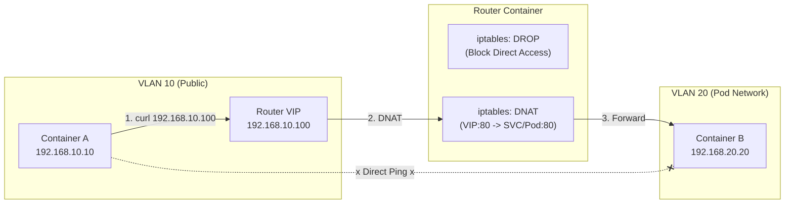
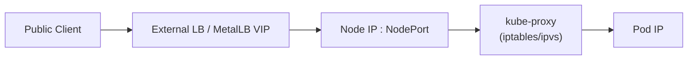

# K8s Service (LoadBalancer) Workshop: Building a Virtual LB with iptables

This workshop extends the environment from [vlan_en.md](./vlan_en.md).
We will learn how Kubernetes `Service (Type: LoadBalancer)` and `MetalLB` manipulate packets behind the scenes by reproducing the behavior using standard Linux features.

## Goal

**"Reach Service/Pod on the Pod network (VLAN 20) via a VIP from Public (VLAN 10)."**



## How K8s Actually Forwards

LoadBalancer is split into **"VIP advertisement"** and **"forwarding from Service/NodePort to Pods."**
`kube-proxy` is responsible for the latter by programming iptables/ipvs DNAT/SNAT rules.



In this workshop, the **Router container plays LB + Node + kube-proxy** in one place.

## Prerequisites

- Complete up to Step 6 of `vlan_en.md`. Containers `a`, `b`, and `router` must be running.

---

## Step 1. Prepare the Web Server

Start a simple web server on the Pod side (Container B).

```bash
# Install netcat if missing
sudo podman exec b apk add --no-cache busybox-extras

# Start a simple HTTP server on Container B (Port 80)
sudo podman exec -d b sh -c "while true; do echo -e 'HTTP/1.1 200 OK\n\nHello from Pod B' | nc -l -p 80; done"
```

---

## Step 2. Network Isolation (Firewall)

For this experiment, we block direct communication from VLAN 10 (Public) to VLAN 20 (Pod).
In K8s, it is a principle to "use Service IP instead of accessing Pod IP directly." We will forcibly reproduce this.

```bash
# Add a rule to block forwarding on the Router
sudo podman exec router iptables -I FORWARD -i eth0 -o eth1 -j DROP
```

**Verification:**
Confirm that Ping from Container A to B fails.

```bash
sudo podman exec a ping -c 2 192.168.20.20
# Result: 100% packet loss (Unreachable)
```

---

## Step 3. Configure VIP (Virtual IP)

Add a new IP address (`192.168.10.100`) to the router's VLAN 10 interface (`eth0`).
This corresponds to the **LoadBalancer IP (External IP)** in K8s.

```bash
# Add IP to eth0
sudo podman exec router ip addr add 192.168.10.100/32 dev eth0
```

- **Note:** `/32` means a single host IP (just this VIP). MetalLB (L2 mode) does essentially the same thing. For ARP requests ("Who has this IP?"), the router answers "I have it (here is the MAC address)."

---

## Step 4. Configure DNAT (Destination NAT)

This is the **core of K8s Services**.
Write a rule to "Forward access destined for VIP (`192.168.10.100`) to Pod B (`192.168.20.20`)."

```bash
# DNAT Rule: If destination is 10.100:80, rewrite to 20.20:80
sudo podman exec router iptables -t nat -A PREROUTING \
  -d 192.168.10.100 -p tcp --dport 80 \
  -j DNAT --to-destination 192.168.20.20:80
```

---

## Step 5. Handle Return Traffic (SNAT)

Since we blocked "Direct Communication" in Step 2, the reply from Pod B cannot return to Client A (or routing inconsistencies will occur).
Therefore, we add a setting (SNAT) to "make it appear to Pod B that the request came from the Router (`192.168.20.1`)."

```bash
# SNAT (Masquerade) Rule
# If destination is 20.20:80, rewrite source to Router's IP
sudo podman exec router iptables -t nat -A POSTROUTING \
  -d 192.168.20.20 -p tcp --dport 80 \
  -j MASQUERADE
```

- **Note:** In K8s, `kube-proxy` configures these automatically. Also, when using Cloud LBs, similar translation occurs when forwarding to `NodePort`.

---

## Step 6. Verify Operation

Access the VIP (`192.168.10.100`) from Container A.

```bash
# Install curl (if not installed)
sudo podman exec a apk add --no-cache curl

# Access VIP
sudo podman exec a curl http://192.168.10.100
```

**Expected Result:**

```text
Hello from Pod B
```

We confirmed that while direct access to Container B's IP (`20.20`) is blocked, access is possible via the VIP (`10.100`). This is the fundamental behavior of a Load Balancer.

**Cleanup (optional):** remove the temporary firewall rule after the experiment.

```bash
sudo podman exec router iptables -D FORWARD -i eth0 -o eth1 -j DROP
```

---

## Explanation: Mapping to K8s

| This Workshop | K8s Component / Setting |
| :--- | :--- |
| `ip addr add 192.168.10.100` | **MetalLB (Speaker)** <br> The elected leader node advertises the IP. |
| `iptables ... -j DNAT` | **kube-proxy** <br> Translates access to Service/NodePort to Pod IP. |
| `iptables ... -j DROP` | **NetworkPolicy** (Deny All) <br> Blocks unnecessary direct communication. |

**Note:** kube-proxy does not own VIPs; it only forwards Service/NodePort traffic to Pods. VIP advertisement is handled by the LB side (MetalLB or cloud LB).

Through this workshop, you should understand that a Load Balancer is not "magic," but a combination of **"IP Address Advertisement"** and **"Packet Destination Rewriting (NAT)."**

```
