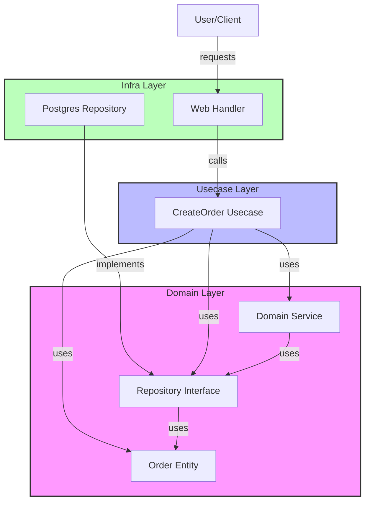

# Clean Architecture Go Workshop

In this workshop, you will learn how to build a robust and testable application using **Go** based on **Clean Architecture**.

## 1. What is Clean Architecture?

Clean Architecture is a design philosophy that separates concerns, keeping business logic independent of frameworks, databases, and external tools.

### The 3 Layers

This workshop adopts a simple and practical **3-layer structure**.

1. **Domain Layer** - `domain/`
    * **Role**: Core business rules and data structures.
    * **Characteristics**: **Depends on nothing**. Written purely in Go.
    * **Components**: Entities, Repository Interfaces, Domain Services.

2. **Usecase Layer** - `usecase/`
    * **Role**: Application-specific business rules (what the user wants to do).
    * **Characteristics**: Depends only on the Domain Layer. Knows nothing about the DB or HTTP details.
    * **Components**: Interactors (Usecases), Input/Output Data Structures (DTOs).

3. **Infrastructure Layer** - `infra/`
    * **Role**: Detailed technical implementations (DB connections, external API calls, web frameworks).
    * **Characteristics**: Can depend on all layers, but primarily implements interfaces defined in the Domain Layer.
    * **Components**: Repository implementations, Web handlers, External clients.

### The Dependency Rule

**"Dependencies always point inwards (towards the Domain)."**
Source code dependencies must always point from lower-level details to higher-level abstractions. The Infrastructure layer knows about the Usecase layer, but the Usecase layer knows nothing about the Infrastructure layer.



---

## Workshop: Building an Order System

We will implement a fictional "Order Creation System," starting from the inside and working our way out.

### Step 1: Designing the Domain Layer (`domain/`)

The Domain Layer is the **heart** of the application and consists of the following three elements. These do not depend on any external (DB or Web) concerns.

1.  **Entity**: Business data and rules (e.g., `Order`, `Inventory`).
2.  **Interface**: Contracts for data persistence or external integration (e.g., `OrderRepository`, `InventoryClient`).
3.  **Domain Service**: Logic that spans multiple entities (e.g., `OrderDomainService`).

First, we define the core business object, the "Order," and the "Interfaces" used to interact with the outside world.

**1. Define Entities (`domain/entity/models.go`)**
Define the state and structure of an Order.

```go
type Order struct {
    ID         string
    CustomerID string
    Amount     float64
    Status     OrderStatus
    CreatedAt  time.Time
}
```

**2. Define Interfaces (`domain/repository/interfaces.go`)**
**Abstract** how data is saved or how external services are accessed. The implementation of these interfaces will be done in Step 3.

```go
// Dependency Inversion Principle (DIP): High-level modules own the abstractions.
type OrderRepository interface {
    Save(ctx context.Context, order *entity.Order) error
}

type InventoryClient interface {
    CheckAndReserve(ctx context.Context, productID string, quantity int) (bool, error)
}

type PaymentPublisher interface {
    PublishPaymentTask(ctx context.Context, order *entity.Order) error
}
```

### Step 2: Implementing the Usecase Layer (`usecase/`)

Combine the Domain Layer components to implement the application feature: "Create an Order."

**Implementation (`usecase/create_order.go`)**

```go
type CreateOrderUsecase struct {
    orderRepo repository.OrderRepository // Depends on abstraction
    // ...
}

func (u *CreateOrderUsecase) Execute(ctx context.Context, input CreateOrderInput) error {
    // 1. Check stock (using Domain Service)
    // 2. Create Order entity
    // 3. Save to database (using Repository)
    // 4. Publish event
}
```

The key point here is that `CreateOrderUsecase` does not know about the concrete database (e.g., Postgres). It only knows the `OrderRepository` interface.

### Step 3: Implementing the Infrastructure Layer (`infra/`)

This is where concrete technologies like "PostgreSQL" or "REST API" appear. **We implement the Domain Layer interfaces defined in Step 1**.

*   `PostgresOrderRepository` implements `domain.OrderRepository`.
*   `RestInventoryClient` implements `domain.InventoryClient`.
*   `RabbitMQPaymentPublisher` implements `domain.PaymentPublisher`.

**Repository Implementation (`infra/repository/postgres_order_repository.go`)**

```go
type PostgresOrderRepository struct {
    // DB connection instance, etc.
}

// Satisfies the domain/repository.OrderRepository interface
func (r *PostgresOrderRepository) Save(ctx context.Context, order *entity.Order) error {
    fmt.Printf("Saving order %s to Postgres\n", order.ID)
    // Actual SQL execution logic...
    return nil
}
```

### Step 4: Assembling the Application (`main.go`)

Finally, we wire up all the parts in `main.go` using **Dependency Injection**.

```go
func main() {
    // 1. Create Infrastructure objects
    orderRepo := &repository.PostgresOrderRepository{}
    inventoryClient := &client.RestInventoryClient{}
    paymentPub := &messaging.RabbitMQPaymentPublisher{}
    idGen := &util.UUIDGenerator{} // ID Generator implementation

    // 2. Create Domain Service
    orderDomainSvc := service.NewOrderDomainService(inventoryClient)

    // 3. Inject into Usecase
    // Pass all necessary dependencies (DI)
    createOrderUsecase := usecase.NewCreateOrderUsecase(
        orderRepo, 
        orderDomainSvc, 
        paymentPub, 
        idGen,
    )

    // 4. Run
    createOrderUsecase.Execute(ctx, input)
}
```

---

## How to Run

Execute the following commands in the project root directory to resolve dependencies and run the application.

```bash
# Tidy up dependencies
go mod tidy

# Run the application
go run main.go
```

If successful, the infrastructure implementation will be called, and logs (like simulated save operations) will be output.

## Summary

* **Robust against change**: Even if you switch the DB to MySQL, the code in `domain` and `usecase` does not change by a single line.
* **Easy to Test**: You only need to mock the `repository` to test the `usecase`. No database is required.
* **Separation of Concerns**: Business logic and technical details are clearly separated.