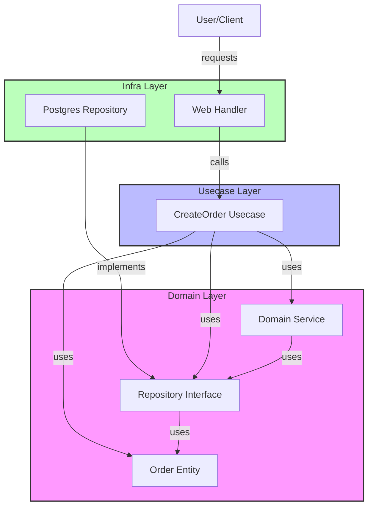

# Clean Architecture Go ワークショップ

このワークショップでは、Go言語を用いて「Clean Architecture」に基づいた堅牢でテスト容易なアプリケーションを構築する方法を学びます。

## 1. Clean Architecture とは？

Clean Architecture（クリーンアーキテクチャ）は、ソフトウェアの関心事を分離し、ビジネスロジックをフレームワークや外部ツールから独立させるための設計指針です。

### 3層構造（The 3 Layers）

本ワークショップでは、シンプルで実用的な **3層構造** を採用します。

1. **ドメイン層 (Domain Layer)** - `domain/`
    * **役割**: ビジネスの中核となるルールとデータ構造。
    * **特徴**: **他のどの層にも依存しません**。純粋なGoのコードのみで記述されます。
    * **構成要素**: エンティティ (Entity), リポジトリインターフェース (Repository Interface), ドメインサービス (Domain Service)。

2. **ユースケース層 (Usecase Layer)** - `usecase/`
    * **役割**: アプリケーション固有のビジネスルール（ユーザーが何をしたいか）。
    * **特徴**: ドメイン層にのみ依存します。DBやHTTPの詳細を知りません。
    * **構成要素**: ユースケース (Interactor), 入力/出力データ構造 (DTO)。

3. **インフラ層 (Infrastructure Layer)** - `infra/`
    * **役割**: 詳細な技術的実装（DB接続、外部API通信、Webフレームワーク）。
    * **特徴**: 全ての層に依存できますが、主にドメイン層のインターフェースを実装します。
    * **構成要素**: リポジトリの実装 (Repository Impl), Webハンドラー, 外部クライアント。

### 依存性のルール (The Dependency Rule)

**「依存は常に内側（ドメイン側）に向かう」**
ソースコードの依存関係は、常に低レベル（詳細）から高レベル（抽象）へ向かいます。インフラ層はユースケースを知っていますが、ユースケースはインフラ層を知りません。




---

## ワークショップ: 注文システムの構築

架空の「注文作成システム」を題材に、内側から外側へと実装を進めていきます。

### Step 1: ドメイン層の設計 (`domain/`)

ドメイン層はアプリケーションの**心臓部**であり、以下の3つの要素で構成されます。これらは外部（DBやWeb）の都合に一切依存しません。

1.  **Entity**: ビジネスデータとルール（例: `Order`, `Inventory`）。
2.  **Interface**: データの永続化や外部連携のための契約（例: `OrderRepository`, `InventoryClient`）。
3.  **Domain Service**: 複数のエンティティにまたがるロジック（例: `OrderDomainService`）。

まずはビジネスのコアとなる「注文 (Order)」と、外界と対話するための契約「インターフェース」を定義します。

**1. エンティティの定義 (`domain/entity/models.go`)**
注文の状態や構造を定義します。

```go
type Order struct {
    ID         string
    CustomerID string
    Amount     float64
    Status     OrderStatus
    CreatedAt  time.Time
}
```

**2. インターフェースの定義 (`domain/repository/interfaces.go`)**
データの保存や外部サービスへのアクセス方法を**抽象化**します。ここで定義したインターフェースの実装は、Step 3で行います。

```go
// 依存性逆転の原則 (DIP): 上位モジュールがインターフェースを所有する
type OrderRepository interface {
    Save(ctx context.Context, order *entity.Order) error
}

type InventoryClient interface {
    CheckAndReserve(ctx context.Context, productID string, quantity int) (bool, error)
}

type PaymentPublisher interface {
    PublishPaymentTask(ctx context.Context, order *entity.Order) error
}
```

### Step 2: ユースケース層の実装 (`usecase/`)

ドメイン層の部品を組み合わせて、「注文を作成する」というアプリケーションの機能を実装します。

**実装 (`usecase/create_order.go`)**

```go
type CreateOrderUsecase struct {
    orderRepo repository.OrderRepository // 抽象に依存
    // ...
}

func (u *CreateOrderUsecase) Execute(ctx context.Context, input CreateOrderInput) error {
    // 1. 在庫チェック (Domain Service利用)
    // 2. 注文エンティティ作成
    // 3. データベース保存 (Repository利用)
    // 4. イベント発行
}
```

ここでのポイントは、`CreateOrderUsecase` が具体的なデータベース（Postgresなど）を知らないことです。知っているのは `OrderRepository` というインターフェースだけです。

### Step 3: インフラ層の実装 (`infra/`)

ここで初めて「PostgreSQL」や「REST API」といった具体的な技術が登場します。**Step 1で定義したドメイン層のインターフェースを実装**します。

*   `PostgresOrderRepository` は `domain.OrderRepository` を実装。
*   `RestInventoryClient` は `domain.InventoryClient` を実装。
*   `RabbitMQPaymentPublisher` は `domain.PaymentPublisher` を実装。

**リポジトリの実装 (`infra/repository/postgres_order_repository.go`)**

```go
type PostgresOrderRepository struct {
    // DB接続インスタンスなど
}

// domain/repository.OrderRepository インターフェースを満たす
func (r *PostgresOrderRepository) Save(ctx context.Context, order *entity.Order) error {
    fmt.Printf("Saving order %s to Postgres\n", order.ID)
    // 実際のSQL実行処理...
    return nil
}
```

### Step 4: アプリケーションの組み立て (`main.go`)

最後に、`main.go` で全てのパーツを組み立てます（Dependency Injection）。

```go
func main() {
    // 1. 依存オブジェクト（Infra）の生成
    orderRepo := &repository.PostgresOrderRepository{}
    inventoryClient := &client.RestInventoryClient{}
    paymentPub := &messaging.RabbitMQPaymentPublisher{}
    idGen := &util.UUIDGenerator{} // ID生成器の実装

    // 2. ドメインサービスの生成
    orderDomainSvc := service.NewOrderDomainService(inventoryClient)

    // 3. ユースケースへの注入
    // 必要な依存をすべて渡す（DI）
    createOrderUsecase := usecase.NewCreateOrderUsecase(
        orderRepo, 
        orderDomainSvc, 
        paymentPub, 
        idGen,
    )

    // 4. 実行
    createOrderUsecase.Execute(ctx, input)
}
```

---

## 実行方法

プロジェクトのルートディレクトリで以下のコマンドを実行し、依存関係を解決してから実行してください。

```bash
# 依存関係の整理
go mod tidy

# アプリケーションの実行
go run main.go
```

成功すると、インフラ層の実装が呼ばれ、注文処理のログ（擬似的な保存処理など）が出力されます。

## まとめ

* **変更に強い**: DBをMySQLに変えても、`domain` や `usecase` のコードは1行も変わりません。
* **テストしやすい**: `usecase` のテストでは、`repository` のモックを作るだけで済みます。DBは不要です。
* **関心の分離**: ビジネスロジックと技術的詳細が明確に分かれています。
