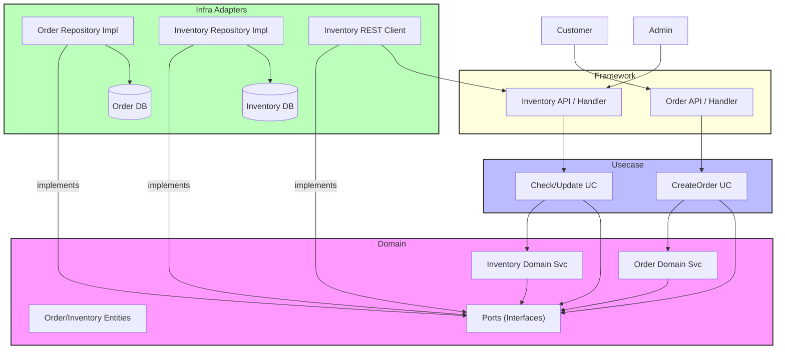

# クリーンアーキテクチャ実習: advent-calm-2025

このワークショップでは、Go言語を用いて「Clean Architecture」に基づいた堅牢でテスト容易なアプリケーションを構築する方法を学びます。
完全なプロジェクトファイルは [advent-of-calm-2025](./advent-of-calm-2025/) ディレクトリにあります。

## 1. Clean Architecture とは？

Clean Architecture（クリーンアーキテクチャ）は、ソフトウェアの関心事を分離し、ビジネスロジックをフレームワークや外部ツールから独立させるための設計指針です。

### 4層構造（The 4 Layers）

本ワークショップでは、シンプルで実用的な **4層構造** を採用します。

1. **ドメイン層 (Domain Layer)** - `domain/`
    * **役割**: ビジネスの中核となるルールとデータ構造。
    * **特徴**: **他のどの層にも依存しません**。純粋なGoのコードのみで記述されます。
    * **構成要素**: エンティティ (Entity), リポジトリインターフェース (Port), ドメインサービス (Domain Service)。

2. **ユースケース層 (Usecase Layer)** - `usecase/`
    * **役割**: アプリケーション固有のビジネスルール（ユーザーが何をしたいか）。
    * **特徴**: ドメイン層にのみ依存します。DBやHTTPの詳細を知りません。
    * **構成要素**: ユースケース (Interactor), 入力/出力データ構造 (DTO)。

3. **インフラアダプター層 (Infra Adapters)** - `infra/`
    * **役割**: ドメインの契約（Port）を具体的に実装し、外部I/O（DB等）との橋渡しを行う。
    * **特徴**: **ドメイン層のインターフェースに依存して実装する層**です（依存は内向き）。
    * **構成要素**: リポジトリの実装 (Repository Impl), 外部クライアント (Client Impl), DB 連携。

4. **フレームワーク層 (Framework Layer)**
    * **役割**: Web フレームワーク、gRPC、CLI、およびそれらのハンドラー。
    * **特徴**: 最外周の I/O を制御し、入力を UseCase 向けに変換して呼び出します。
    * **構成要素**: Web ハンドラー, Router, DTO 変換。

### 依存性のルール (The Dependency Rule)

**「依存は常に内側（ドメイン側）に向かう」**
ソースコードの依存関係は、常に低レベル（詳細）から高レベル（抽象）へ向かいます。



> **注記: 外部インターフェースの集約**
> `Customer`（注文者）と `Admin`（在庫管理者）は、それぞれ `Gateway` レイヤーの適切な API エンドポイントを叩きます。また、`Order Service` 内の `Inventory REST Client` も、`Admin` と同じ `Inventory API` を利用することで、在庫操作のロジックを一箇所（Inventory UseCase）に集中させています。

> **Ports とは？**
> Ports は「内側のルールが外側に求める契約（インターフェース）」です。DBや外部APIの詳細は Ports の背後に隠れ、ユースケースやドメインサービスは Ports に依存して振る舞いだけを定義します。外側（Infra Adapters）は Ports を実装することで依存方向を内向きに保ちます。

### ポート設計とリポジトリ境界

* **入力ポート:** UseCase が公開するインターフェース。Web/CLI などの Controller はこのポートに依存します。
* **出力ポート:** Domain/UseCase が外側に要求する契約（例: Repository, Client）。インターフェースは内側に置き、実装は Adapter 側に置きます。
* **リポジトリ境界:** 永続化の契約。トランザクション/リトライなどの制御は UseCase 側、データ変換やクエリ組み立ては Adapter 側の責務です。

---

## ワークショップ: 注文システムの構築

架空の「注文作成システム」を題材に、内側から外側へと実装を進めていきます。

### Step 1: ドメイン層の設計 (`domain/`)

ドメイン層はアプリケーションの**心臓部**であり、以下の3つの要素で構成されます。これらは外部（DBやWeb）の都合に一切依存しません。

1. **Entity**: ビジネスデータとルール（例: `Order`, `Inventory`）。
2. **Interface**: データの永続化や外部連携のための契約（例: `OrderRepository`, `InventoryClient`）。
3. **Domain Service**: 複数のエンティティにまたがるロジック（例: `OrderDomainService`）。

**ドメインサービスのルール例**

* `OrderDomainService`: ProductID が空ならエラー、数量が 0 以下ならエラー。
* `InventoryDomainService`: ProductID が空ならエラー、在庫数量が負ならエラー。

まずはビジネスのコアとなる「注文 (Order)」と、外界と対話するための契約「インターフェース」を定義します。

**1. エンティティの定義 (`domain/entity/models.go`)**
注文の状態や構造を定義します。

```go
type Order struct {
	ID         string
	CustomerID string
	Amount     float64
	Status     OrderStatus
	CreatedAt  time.Time
}
```

**2. インターフェース（Ports）の定義 (`domain/repository/interfaces.go`)**
データの保存や外部サービスへのアクセス方法を**抽象化**します。ここで定義したインターフェースの実装は、Step 3で行います。

```go
// 依存性逆転の原則 (DIP): 上位モジュールがインターフェースを所有する
type OrderRepository interface {
	Save(ctx context.Context, order *entity.Order) error
	FindByID(ctx context.Context, id string) (*entity.Order, error)
}

type InventoryClient interface {
	CheckAndReserve(ctx context.Context, productID string, quantity int) (bool, error)
}

type PaymentPublisher interface {
	PublishPaymentTask(ctx context.Context, order *entity.Order) error
}
```

> **補足: context.Context の扱い**
> Go では Ports に `context.Context` を渡す実装も一般的ですが、**純粋性を優先するなら usecase 層で止める**設計もあります。教材としては用途に応じたトレードオフとして理解してください。

### Step 2: ユースケース層の実装 (`usecase/`)

ドメイン層の部品を組み合わせて、「注文を作成する」というアプリケーションの機能を実装します。

**実装 (`usecase/create_order.go`)**

```go
type CreateOrderUsecase struct {
	orderRepo repository.OrderRepository // 抽象に依存
	// ...
}

func (u *CreateOrderUsecase) Execute(ctx context.Context, input CreateOrderInput) error {
	// 1. 在庫チェック (Domain Service利用)
	// 2. 注文エンティティ作成
	// 3. データベース保存 (Repository利用)
	// 4. イベント発行
}
```

ここでのポイントは、`CreateOrderUsecase` が具体的なデータベース（Postgresなど）を知らないことです。知っているのは Ports（`OrderRepository` など）のみです。

> **補足: 取引の一貫性（DB保存とMQ発行）**
> この例では「DB保存 → MQ発行」を順に実行しています。現実のシステムでは、トランザクション境界や補償（Outboxパターン等）を検討し、二重送信や送信漏れを防ぐ設計が必要です。

### Step 3: インフラアダプター層の実装 (`infra/`)

ここで初めて「PostgreSQL」や「REST API」といった具体的な技術が登場します。**Step 1で定義したドメイン層のインターフェースを実装**します。DBドライバやSDKなどの実体は Frameworks/Drivers 側に追い出します。

* `PostgresOrderRepository` は `domain.OrderRepository` を実装。
* `RestInventoryClient` は `domain.InventoryClient` を実装。
* `RabbitMQPaymentPublisher` は `domain.PaymentPublisher` を実装。

**リポジトリの実装 (`infra/repository/postgres_order_repository.go`)**

```go
type PostgresOrderRepository struct {
	// DB接続インスタンスなど
}

// domain/repository.OrderRepository インターフェースを満たす
func (r *PostgresOrderRepository) Save(ctx context.Context, order *entity.Order) error {
	fmt.Printf("Saving order %s to Postgres\n", order.ID)
	// 実際のSQL実行処理...
	return nil
}
```

### Step 4: アプリケーションの組み立て (`main.go`)

最後に、`main.go` で全てのパーツを組み立てます（Dependency Injection）。

```go
func main() {
	// 1. 依存オブジェクト（Infra Adapters）の生成
	orderRepo := &repository.PostgresOrderRepository{}
	inventoryClient := &client.RestInventoryClient{}
	paymentPub := &messaging.RabbitMQPaymentPublisher{}
	idGen := &util.UUIDGenerator{} // ID生成器の実装

	// 2. ドメインサービスの生成
	orderDomainSvc := service.NewOrderDomainService(inventoryClient)
	inventoryRepo := &repository.PostgresInventoryRepository{}
	inventoryDomainSvc := service.NewInventoryDomainService(inventoryRepo)

	// 3. ユースケースへの注入
	createOrderUsecase := usecase.NewCreateOrderUsecase(orderRepo, orderDomainSvc, paymentPub, idGen)
	checkInventoryUsecase := usecase.NewCheckInventoryUsecase(inventoryDomainSvc)
	updateInventoryUsecase := usecase.NewUpdateInventoryUsecase(inventoryDomainSvc)

	// 4. 実行
	createOrderUsecase.Execute(ctx, input)
	checkInventoryUsecase.Execute(ctx, checkInput)
}
```

---

## 設計分析と品質 (Clean Architecture 分析)

本プロジェクトは以下の観点で高品質な設計が維持されています。

1. **疎結合な設計**: 注文 (Order) と 在庫 (Inventory) がドメインレベルで分離されており、将来的なマイクロサービス化が容易です。
2. **ビジネスロジックの純粋性**: `domain` パッケージには外部ライブラリへの依存が一切なく、ビジネスルールのみが記述されています。
3. **拡張性**: 新しい通知手段（メール、Slack等）を追加する場合も、`domain/repository` にインターフェースを追加し、`infra` で実装するだけで対応可能です。

---

## 実行方法

プロジェクトのルートディレクトリで以下のコマンドを実行し、依存関係を解決してから実行してください。

```bash
# 依存関係の整理
go mod tidy

# アプリケーションの実行
go run main.go
```

成功すると、インフラアダプター層の実装が呼ばれ、注文処理のログ（擬似的な保存処理など）が出力されます。

## まとめ

* **変更に強い**: DBをMySQLに変えても、`domain` や `usecase` のコードは1行も変わりません。
* **テストしやすい**: `usecase` のテストでは、`repository` のモックを作るだけで済みます。DBは不要です。
* **関心の分離**: ビジネスロジックと技術的詳細が明確に分かれています。
