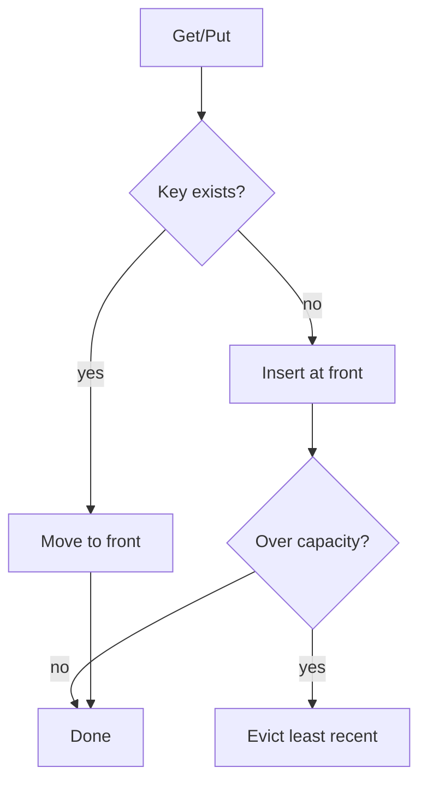
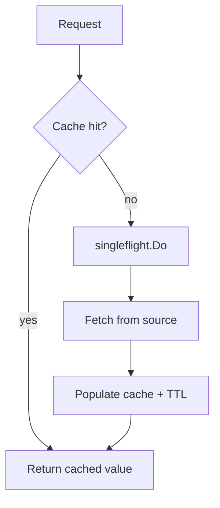
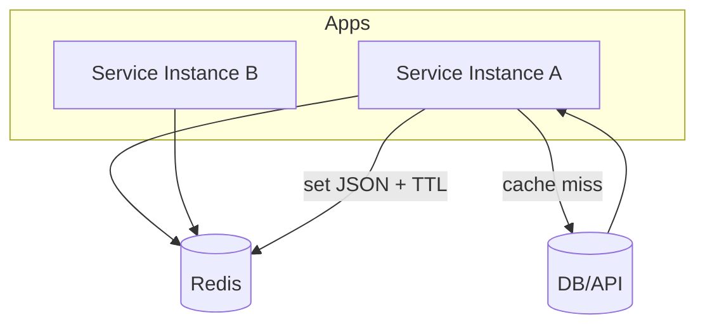
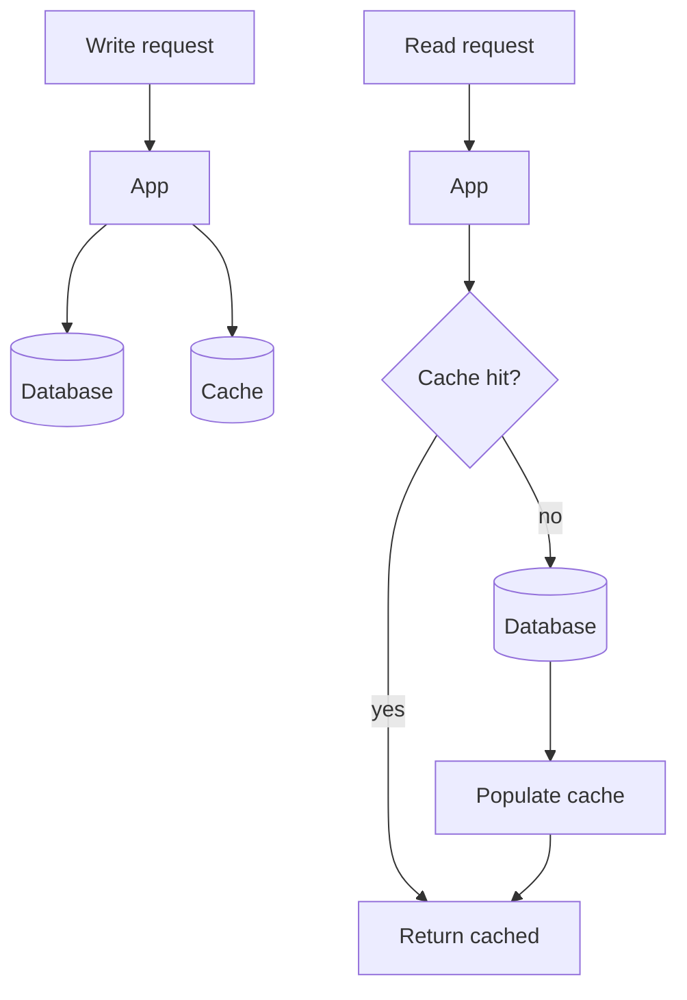

# Caching Patterns in Go

## Understanding Cache Systems and Cache Tools

### Fundamentals

#### What Is Cache?

Cache is a temporary storage layer that holds frequently accessed data closer to where it is needed.
Its primary purpose is to **speed up data retrieval** and **reduce load** on slower primary data sources such as databases.

**Analogy**
Keeping your favorite coffee mug on your desk instead of walking to the kitchen every time.

---

#### Why Cache Matters: Performance Impact

##### Instant Response Times

* Serves data directly from cache
* Avoids slow database queries
* Sub-millisecond latency

##### Reduced Backend Load

* Absorbs traffic spikes
* Prevents database bottlenecks

##### Cost Savings

* Fewer database queries
* Reduced network bandwidth usage
* Lower server resource consumption

**Real-world example**
E-commerce platforms cache product details to survive flash sales without melting their databases.

---

#### Cache Architecture: Where Is Cache Stored?

##### Local Cache

* Stored in application memory (RAM)
* Extremely fast access
* Limited capacity
* Data lost on process crash

##### Distributed Cache

* Shared across multiple servers
* Scales horizontally
* More resilient than local cache
* Slightly higher latency than local memory

##### Edge Cache

* Located geographically close to users
* Typically implemented via CDNs
* Minimizes internet latency
* Improves global user experience

---

#### Caching Strategies: How Data Flows

##### 1. Write-Through

* Writes go to cache and database synchronously
* Strong consistency
* Increased write latency

##### 2. Write-Back

* Writes go to cache first
* Database updated asynchronously
* Faster writes
* Risk of data loss if cache fails

##### 3. Cache-Aside (Lazy Loading)

* Application checks cache first
* On miss, load from database and cache it
* Good balance between performance and freshness
* Most commonly used in practice

---

#### Cache Invalidation: The Hard Problem

> “There are only two hard things in Computer Science: cache invalidation and naming things.”

Cached data can become **stale** when the source of truth changes.

##### Common Invalidation Approaches

###### Time-Based Expiration (TTL)

* Cached entries expire automatically after a fixed duration

###### Manual Purging

* Explicitly delete cache entries when data changes
* Requires careful coordination

###### Event-Driven Invalidation

* Cache cleared based on database events or message queues
* More complex, more accurate

---

#### Featured Tool: Redis

Redis is an open-source, in-memory data store commonly used as:

* Cache
* Database
* Message broker

It is widely adopted in high-performance systems.

##### Key Features

* Sub-millisecond read/write latency
* Rich data structures:

  * Strings
  * Hashes
  * Lists
  * Sets
  * Sorted sets
* Optional persistence to disk
* Atomic operations

##### Common Use Cases

###### Session Storage

* Fast authentication
* Shared session state across services

###### Leaderboards

* Real-time ranking using sorted sets
* Gaming and competition platforms

###### Real-Time Analytics

* Counters
* Streaming metrics
* Dashboards and monitoring

---

#### Decision Guide: When to Use Cache

##### Ideal Use Cases

* Read-heavy workloads
* Relatively stable data
* Expensive computations or queries

##### Not Suitable For

* Write-heavy systems
* Strong, immediate consistency requirements
* Unbounded or unpredictable data sets

##### Trade-offs to consider

* Added system complexity
* Risk of stale data
* Operational overhead

---

#### Summary: Cache as a Performance Multiplier

1. **Cache reduces latency**
   Faster access, lower backend pressure, better user experience.

2. **Choose the right strategy**
   Cache type, placement, and invalidation must match system needs.

3. **Redis provides flexibility**
   Feature-rich and scalable for modern applications.

4. **Experiment and measure**
   Start simple, instrument everything, and validate with real metrics.

## Pattern 1: Thread-Safe In-Memory TTL Cache

### Core Concept

A foundational caching pattern that stores string keys mapped to byte slice values with time-to-live (TTL) expiration.
Thread-safe via mutex synchronization, making it safe for concurrent goroutines.

### Flow Diagram

```mermaid
flowchart TD
    A[Get(key)] --> B{Entry exists?}
    B -- no --> C[Cache miss]
    B -- yes --> D{Expired?}
    D -- yes --> E[Delete entry] --> C
    D -- no --> F[Return value]
    C --> G[Fetch from source]
    G --> H[Set with TTL]
    H --> F
```

### Key Implementation Details

* `sync.RWMutex` protects concurrent access
* Each entry stores:

  * value
  * expiration timestamp
* Lazy expiration checks on `Get` operations
* Zero external dependencies

### When to Use

Best for **single-instance applications** that need basic caching without distributed requirements.

Typical use cases:

* Configuration data
* Computed results
* API responses with predictable lifespans

### Trade-offs

* Memory can grow unbounded without active cleanup
* No LRU eviction
* Expiration control relies entirely on TTL values

### Reference Implementation

`software/go_cache_patterns/pattern1_ttl_cache/main.go`

---

## Pattern 2: LRU Cache with Bounded Memory

### LRU Overview

A cache with predictable memory usage that evicts cold data automatically using a Least Recently Used (LRU) policy.

### LRU Flow Diagram



### Implementation Steps

1. **Initialize with Capacity**

   * Set maximum entry count
   * Use `container/list` (doubly-linked list)

2. **Track Access Order**

   * Move accessed items to the front
   * Maintains recency ordering

3. **Evict on Overflow**

   * Remove least-recently-used entry from the tail when capacity is reached

4. **Maintain Hash Map**

   * Map keys to list nodes
   * Ensures O(1) lookup performance

### Why This Works

The `container/list` package provides O(1) operations for:

* Access
* Updates
* Eviction

This makes the pattern production-ready for **memory-constrained environments**.

### LRU Reference Implementation

`software/go_cache_patterns/pattern2_lru_cache/main.go`

---

## Pattern 3: Cache-Aside with Singleflight Protection

### Overview

The most widely deployed caching pattern in production systems.
Designed to prevent **cache stampede** scenarios where many concurrent cache misses overwhelm the backend.

### Cache-Aside Flow Diagram



### Request Flow

1. **Check Cache**

   * Attempt read from cache layer first

2. **Query Source**

   * On cache miss, fetch from database or API using `singleflight`

3. **Populate Cache**

   * Store fetched data with appropriate TTL

4. **Return Result**

   * Serve the result to all waiting requests

### Singleflight Explained

The `golang.org/x/sync/singleflight` package coalesces duplicate requests into a single backend call.

**Example:**
If 200 goroutines request the same uncached key simultaneously:

* Only **one** hits the database
* The other 199 wait for the shared result

### Why It Matters

#### Without Singleflight

* 200 concurrent database queries
* Backend overload
* Response time spikes
* Cascading service failures

#### With Singleflight

* One database query
* Stable response times
* Graceful traffic spike handling

### Cache-Aside Reference Implementation

`software/go_cache_patterns/pattern3_cache_aside_singleflight/main.go`

---

## Pattern 4: Distributed Redis Cache with Go-Redis

### Redis Cache Overview

Redis is the industry-standard distributed caching solution.
Multiple application instances share a single cache, enabling horizontal scaling and shared state.

### Redis Flow Diagram



### Key Characteristics

#### JSON Serialization

* Marshal Go structs to JSON
* Human-readable
* Debuggable via `redis-cli`

#### Native TTL Support

* Redis handles expiration automatically
* TTL set on write
* No manual cleanup required

#### Shared State

* All application instances access the same cache
* Ideal for:

  * Microservices
  * Load-balanced deployments
  * Session consistency

### Client Library

`go-redis/redis/v8` provides:

* Idiomatic Go APIs
* Connection pooling
* Pipelining
* Cluster support

Minimal wrapper code required for production use.

### Redis Reference Implementation

`software/go_cache_patterns/pattern4_redis_cache/main.go`

---

## Pattern 5: Write-Through Cache Pattern

### Write-Through Overview

Synchronously updates both database and cache on every write.
This pattern prioritizes **consistency over write performance**.

### Flow Diagram



### Write Flow

1. **Receive Write Request**

   * Application receives data update from client

2. **Update Database**

   * Persist changes to the primary datastore

3. **Update Cache**

   * Immediately synchronize cache with new data

4. **Confirm Success**

   * Return success only after both operations complete

### Advantages

* Guaranteed cache consistency
* No stale reads after writes
* Simple mental model for data state

### Write-Through Trade-offs

* Slower write operations
* Cache must be available
* Increased write latency

### Write-Through Reference Implementation

`software/go_cache_patterns/pattern5_write_through/main.go`
